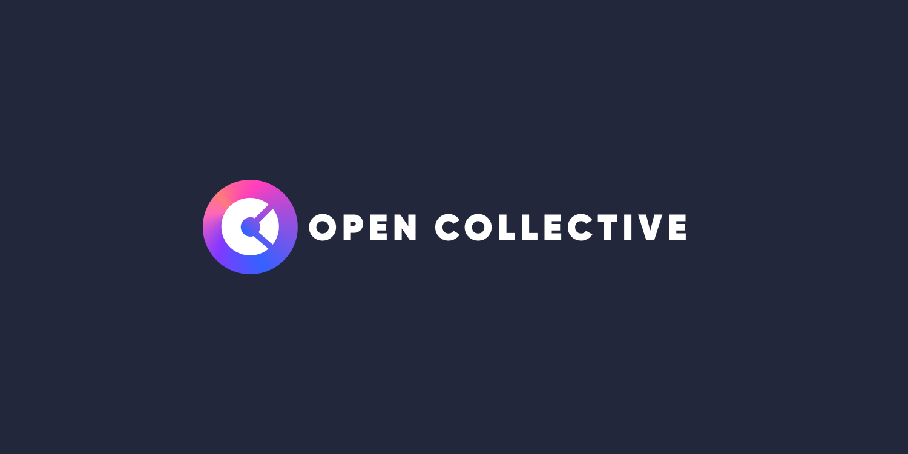
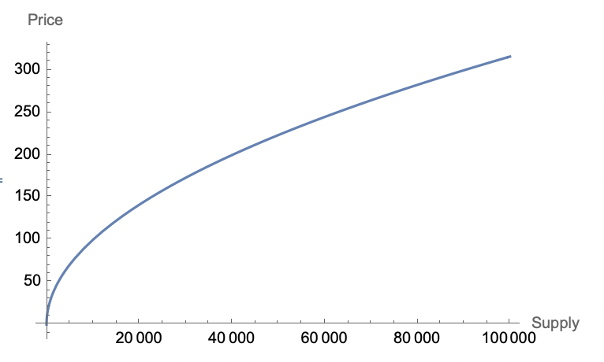
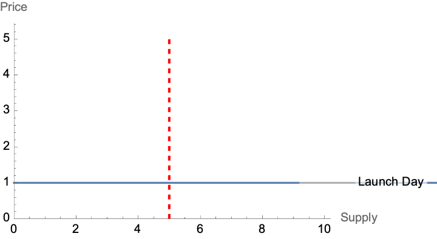
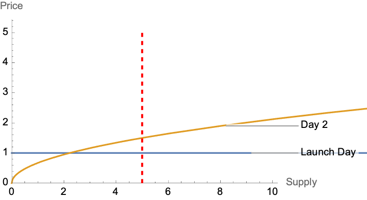
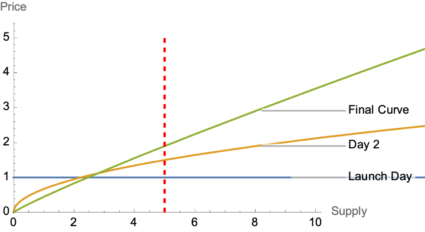

# The Open Collective

If you're not familiar with Strata, you can read more about the protocol [here](https://blog.strataprotocol.com/welcome)

A **collective** is for like minded creators that want to pool resources and bond their directional success to others. Collectives also allow fans to take directional positions on the success of groups or categories rather than individuals alone. Viewed through this lens, collectives can be seen as idea indices.

The **Open Collective** (OPEN) is the default collective on Strata. When a token is created without a collective or base mint specified, the default is to place that token into the Open Collective.

While some collectives can be exclusive, requiring permission to join, the Open Collective allows anyone to join. The Open Collective also takes no fees or royalties.

The Open Collective is truly decentralized. We, the Strata Team, get no cut of the OPEN token. We believe that taking a cut would stifle innovation.

## Anatomy of the Open Collective

- **Token**. This is the OPEN token. Every member of the collective will be bonded to it via a [Bonding Curve](https://docs.strataprotocol.com/learn/bonding_curves)
- **Bonding curve**. Users can quickly purchase OPEN tokens using the SOL/OPEN bonding curve. The price is a function of the current supply.
  - **Royalties**. OPEN has **no royalties** on buy/sell through the bonding curve.
- **Exclusivity**. The OPEN collective allows anyone to bind their token to OPEN and join the collective. It does not require sign off for new members
- **Configuration**.
  - Limited royalties on sell: Users cannot set sell royalties unreasonably high, devaluing the token.
  - **Unclaimed Token Settings**
    - Symbol: UNCLAIMED
    - Social Token royalties on buy: 5%
    - All royalties are owned by the person who claims this token

## Why buy OPEN?

Applications like [Wum.bo](https://wum.bo) use the Open Collective to make it possible to create tokens in one-click for users that have yet to join the platform.

As Wum.bo expands, OPEN-based tokens will be created for a variety of social media accounts, including Twitter.

### The Community

Ultimately, the decision to buy OPEN is an investment in the community that will form around the Open Collective. It is backing every creator and unclaimed token that is based on the Open Collective.

### No fees

The OPEN collective takes no fees. This means that, while you are still exposed to risk in fluctuating price, it costs nothing but the Solana transaction fees to get OPEN tokens.

This also makes the open collective a good choice for a creator that wants a social token, as there is no middle-man taking a cut.

The hope is that the Open Collective pushes future collectives to innovate.
If a collective is going to pool resources in the form of royalties, it should offer something in return.
That might mean building a website, setting up a storefront, or just riding on the network effects of a strong collective.

### Network Effects

Creators can use the Open Collective to join an existing, established network. As the network of open collective improves its value, the value of every individual social token in the network is improved.

### Trust

The Open Collective limits royalties on token sales. This keeps the authority on a token from completely devaluing the token for all holders. While OPEN tokens do still carry risk, the risk is in token holders selling and not necessarily changes from the authority.

The Open Collective ensures that all unclaimed tokens follow a similar, fairly shaped bonding curve. It also ensures that royalties are set aside to incentivize the token's owner to claim the token.

### Access

Buying OPEN will allow you to buy the social tokens of anyone within the open collective

## OPEN Risks

OPEN is just one of many collectives that will form on Strata. It has a distinct advantage in that it is the default collective, but it is also not being managed as an organization.

### No fees

No royalties means that the Open Collective has no treasury. The Open Collective is not an organization. It will not provide services because it does not have funds to do so.

Members of the collective may choose to provide services because they are incentive aligned with the Open Collective.

### No Team

Neither the Wum.bo team nor the Strata team own, or are taking any share of the Open Collective. As such, the Open Collective is not backed by a team.
While the community that forms around the Open Collective will drive it forward because of the incentive alignment; there is no core team.

OPEN is a truly decentralized utility token.

**OPEN in no way represents ownership in Strata or Wum.bo**

The teams of both Strata and Wum.bo want to see the Open Collective succeed because they want to see the entire protocol succeed. They want to drive value into this newly forming economy. Neither team, however, will ever pick sides or choose winners amongst collectives.

## Collective Movement

While not currently supported, the goal is to allow free movement of ones token from one collective to another. This ability may hurt or help the open collective. This will lead to higher competition between collectives.
This could either drive users back to the Open Collective, if other Collectives fail to deliver. Or it could drive users away from the Open Collective, as
other collectives that take royalties provide greater utility.

## OPEN Fair Launch

The OPEN token will launch on a bonding curve with the formula

$$
  P = c * S^k
$$

**Choices for k and c have not yet been finalized**

This plot visualizes the formula when $c = 1$ and $k = 0.5$

### Reward Early Adopters, not Bots

The curve above rewards whoever gets their transactions through first on launch day. In practice, that will be bots.

The solution to this is to have a curve that changes shape over time. All day-1 buyers get the same price.
The bots had no advantage in getting their transactions through sooner, as they received the same price as everyone else.

After day 1, the curve begins to steepen:

Over time, the curve steepens to its final shape:

