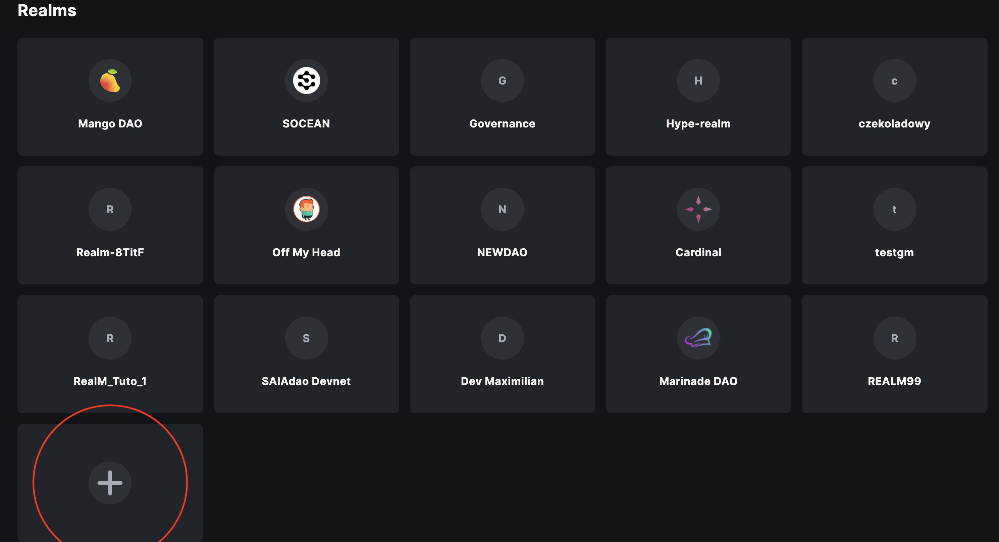
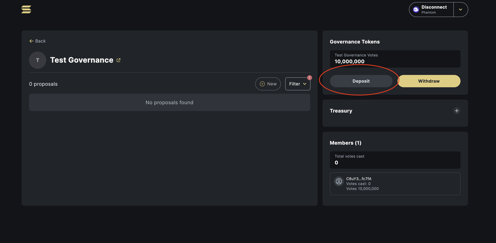
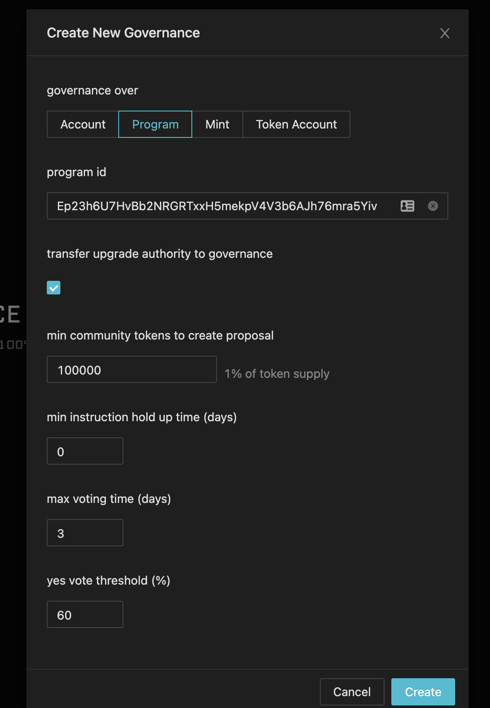
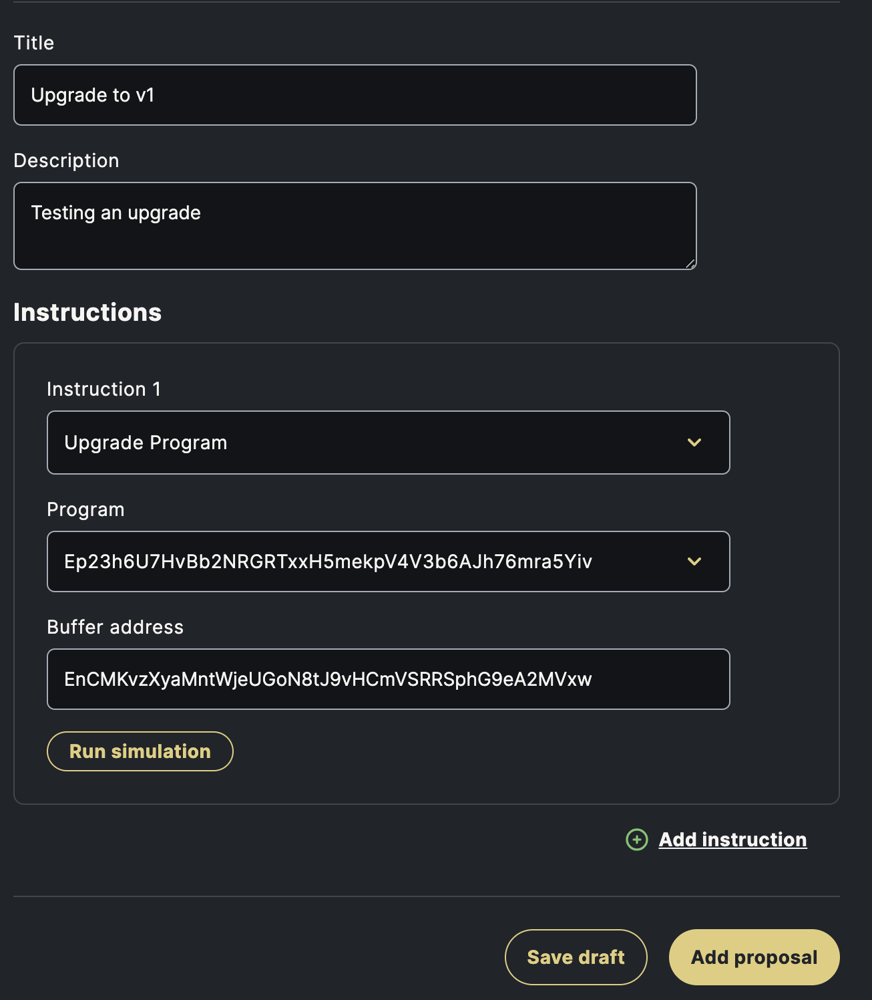

# Setting up CI/CD with Governance on your Anchor Programs

Have you been deploying your programs with `solana program deploy`, using deploy keys that sit on your computer? While it works for prototyping, it's not great for a production program on mainnet that's holding real money.

Local deploy keys are a security risk. If your computer is compromised, a hacker could take the deploy keys and do whatever they want with your program; including siphon all funds stored in or owned by the program.

Multisigs are great for simplicity, but with governance you can transfer voting shares around. You can also change the voting settings as the project evolves.

By the end of this guide, you'll have an Anchor program that automatically creates a Governance proposal with an Anchor Verified Build when you push a `git` tag to master/main. All you need to do is vote on the proposal, then execute the transaction.

:::note
Do this in devnet before you try it on mainnet
:::

In this guide, we're going to setup

  * Issue governance voting shares
  * Setup SPL Governance around an Anchor Program
  * Deploying a program using governance
  * Automating program deployments using CI/CD
  * Anchor Verifiable Builds


# Issue Govenance Voting Shares

First, let's issue a governance token. We're going to use Metaplex spl-token-metadata to asssociate a name and symbol with our governance token, so it's easy to use in wallets.

```js
import { ASSOCIATED_TOKEN_PROGRAM_ID, Token, TOKEN_PROGRAM_ID, u64 } from "@solana/spl-token";
import { Connection, Keypair, sendAndConfirmTransaction, SystemProgram, Transaction } from '@solana/web3.js';
import { createMetadata, Data } from "@strata-foundation/spl-utils";
```

```js async
// You may want to grind this to have a custom mint keypair
const mintKeypair = Keypair.generate();
const connection = provider.connection;
const wallet = provider.wallet.publicKey;
const mintAddress = mintKeypair.publicKey.toBase58();

const tx = new Transaction();
// Our associated token account for the governance token
const ata = await Token.getAssociatedTokenAddress(ASSOCIATED_TOKEN_PROGRAM_ID, TOKEN_PROGRAM_ID, mintKeypair.publicKey, wallet);

// Create a governance mint with 10mm shares, send them all to your wallet. You can distribute them later.
const instructions = [
  SystemProgram.createAccount({
    fromPubkey: wallet,
    newAccountPubkey: mintKeypair.publicKey,
    space: 82,
    lamports:
      await connection.getMinimumBalanceForRentExemption(
        82
      ),
    programId: TOKEN_PROGRAM_ID,
  }),
  Token.createInitMintInstruction(
    TOKEN_PROGRAM_ID,
    mintKeypair.publicKey,
    9,
    wallet,
    null
  ),
  Token.createAssociatedTokenAccountInstruction(
    ASSOCIATED_TOKEN_PROGRAM_ID,
    TOKEN_PROGRAM_ID,
    mintKeypair.publicKey,
    ata,
    wallet,
    wallet
  ),
  Token.createMintToInstruction(
    TOKEN_PROGRAM_ID,
    mintKeypair.publicKey,
    ata,
    wallet,
    [],
    new u64("10000000000000000")
  )
]
// Add metaplex token metadata while we have mint authority
await createMetadata(
  new Data({
    name: "Test Governance",
    symbol: "tGOV",
    uri: "",
    sellerFeeBasisPoints: 0,
    // @ts-ignore
    creators: null,
  }),
  wallet.toBase58(),
  mintKeypair.publicKey.toBase58(),
  wallet.toBase58(),
  instructions,
  wallet.toBase58()
),
tx.add(
  ...instructions,
  Token.createSetAuthorityInstruction(
    TOKEN_PROGRAM_ID,
    mintKeypair.publicKey,
    null,
    'MintTokens',
    wallet,
    []
  )
);
tx.recentBlockhash = (await connection.getRecentBlockhash()).blockhash;
tx.feePayer = wallet;

await provider.send(tx, [mintKeypair]);
```

**Take note of the mint address above**. Mine was "65uCXAukbwXFMUdT75SjmBfr6HhFL4h17QtzsM5MdmLD"

If you check your wallet, you should see our test governance token. After you're done with this guide, you can send it to anyone you'd like.


# Setup SPL Governance

First, to setup governance we must have deployed the anchor program once. If you haven't yet, run

```
anchor deploy --provider.cluster devnet
```

You'll also want to init the idl:

```
anchor idl init <YOUR_PROGRAM_ADDRESS> --filepath target/idl/<YOUR_PROGRAM>.json --provider.cluster devnet
```

Since you likely deployed with a local deploy key, you will want to temporarily transfer the authority to your current web wallet.

```
solana program set-upgrade-authority -u devnet <PROGRAM_ADDRESS> --new-upgrade-authority <YOUR_WALLET_ADDRESS>
```

Now we will need to create a realm. Navigate to: https://realms.today?cluster=devnet

Once you connect your wallet, you should be able to click this plus to add a realm:



Fill out this form with your mint from earlier as the community mint id:


You'll be taken to your governance page, I.e. https://realms.today/dao/5VchfiRHocpJWNRGHLaMmQBTRiNXT7JbVvxWEgQURpX?cluster=devnet

Deposit your governance tokens using the deposit button



This next part, you need to (temporarily) do in the old governance UI. Take the address after /dao/ that you're at in the realms.today url, and paste it into this url.

https://solana-labs.github.io/oyster-gov/#/realm/YOUR-REALM-ID?programId=GovER5Lthms3bLBqWub97yVrMmEogzX7xNjdXpPPCVZw

You should be at the old governance UI. Click the dots, then create new governance


Select Program, and fill out your program information. You can also fill out voting threshold information:



After you create your governance, you will be taken to a page at some url like this one:

https://solana-labs.github.io/oyster-gov/#/governance/GSGB9BDcb29u8fbigqeFLz1JQ64C4G4H5KRQbzNDJUcJ?programId=GovER5Lthms3bLBqWub97yVrMmEogzX7xNjdXpPPCVZw

**Note the address after /governance**. Copy that to your clipboard, you'll need it in the next step.

After you create this governance, you should be able to navigate back to the new UI, I.e. https://realms.today/dao/YOUR-REALM-ID?cluster=devnet.

# Deploying your first Update

Deploying with governance works in two steps. First, we'll write a buffer to Solana. Then, we'll create a Proposal to deploy that buffer. This allows us to separate building from signing to deploy.

```
solana program write-buffer /path/to/your/deploy/contract.so -u devnet
```

This write buffer will be owned by you, so let's transfer it to your governance. Remember that address we copied to clipboard?

```
solana program set-buffer-authority <YOUR_BUFFER_FROM_ABOVE> --new-buffer-authority <GOVERNANCE_ID_FROM_CLIPBOARD> -u devnet
```

Now that we've deployed our buffer, let's propose an upgrade to our contract:

Click the "New" Button on the realm page, then fill it out with your buffer:



Once you've created your proposal, you will be able to vote on it like so:


Once the vote passes, click on the instructions drop down and scroll down to execute:


Done!! Now you've succesfully deployed your first program using SPL Governance!

# Automation

If you're like me, you're probably thinking: "this could use some automation." 

Yup. Let's set this up.

First, let's transfer the IDL to governance:

```
anchor idl set-authority --provider.cluster devnet --program-id <PROGRAM_ADDRESS> --new-authority <GOVERNANCE_ID>
```

