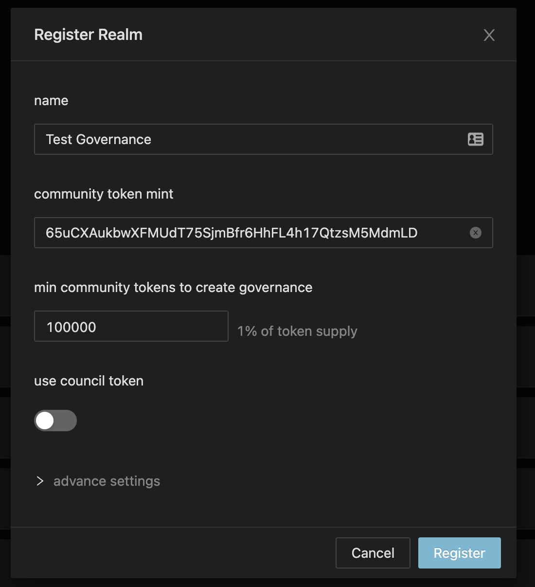

## Automated Governance on your Anchor Programs

Have you been deploying your programs with `solana program deploy` with deploy keys on your local file system? While it works for prototyping, it's not great for a production program on mainnet that's holding real money.

Local deploy keys are a security risk. If your computer is compromised, a hacker could take the deploy keys and do whatever they want with your program; including siphon all funds stored in or owned by the program.

Multisigs are great for simplicity, but with governance you can transfer voting shares around. You can also change the voting settings as the project evolves. It's also got a nifty UI!

In addition to the security risks of deploying locally, there's also several risks associated with manually deploying to mainnet, including:

  * Accidentally deploying dev code to mainnet because you ran the wrong command
  * Updating the program but not the IDL
  * Forgetting to publish a verified build
  * Inconsistency with your git repository and what's deployed, making debugging difficult.

By the end of this guide, we'll set up automation such that when you push release tags to `master`, you'll get a Governance proposal to deploy the contract. All you need to do is sign off and vote on the proposal, then execute the transaction. `push`, then go to a UI and deploy. For devnet, you'll get a new proposal every time the rust code changes on `master`

:::note
Do this in devnet before you try it on mainnet
:::

In this guide, we're going to:

  * Issue governance voting shares
  * Setup SPL Governance around an Anchor Program
  * Deploying a program using governance without CI/CD
  * Automate program deployments using CI/CD
  * Setup Anchor Verifiable Builds


## Issue Govenance Voting Shares

Governance works by creating and executing proposals to upgrade the program. These proposals are voted on by governance token holders. In a simple case, the governance token holders may just be the founders of the company. If all hold an even number of tokens, this acts like a multisig.

Let's issue a governance token. We're going to use Metaplex spl-token-metadata to asssociate a name and symbol with our governance token, so it's easy to use in wallets. You can edit the name and symbol in `createMetadata` to name your own token.

```js
import { ASSOCIATED_TOKEN_PROGRAM_ID, Token, TOKEN_PROGRAM_ID, u64 } from "@solana/spl-token";
import { Connection, Keypair, sendAndConfirmTransaction, SystemProgram, Transaction } from '@solana/web3.js';
import { createMetadata, Data } from "@strata-foundation/spl-utils";
```

```js async
// You may want to grind this to have a custom mint keypair
const mintKeypair = Keypair.generate();
const connection = provider.connection;
const wallet = provider.wallet.publicKey;
const mintAddress = mintKeypair.publicKey.toBase58();

const tx = new Transaction();
// Our associated token account for the governance token
const ata = await Token.getAssociatedTokenAddress(ASSOCIATED_TOKEN_PROGRAM_ID, TOKEN_PROGRAM_ID, mintKeypair.publicKey, wallet);

// Create a governance mint with 10mm shares, send them all to your wallet. You can distribute them later.
const instructions = [
  SystemProgram.createAccount({
    fromPubkey: wallet,
    newAccountPubkey: mintKeypair.publicKey,
    space: 82,
    lamports:
      await connection.getMinimumBalanceForRentExemption(
        82
      ),
    programId: TOKEN_PROGRAM_ID,
  }),
  Token.createInitMintInstruction(
    TOKEN_PROGRAM_ID,
    mintKeypair.publicKey,
    9,
    wallet,
    null
  ),
  Token.createAssociatedTokenAccountInstruction(
    ASSOCIATED_TOKEN_PROGRAM_ID,
    TOKEN_PROGRAM_ID,
    mintKeypair.publicKey,
    ata,
    wallet,
    wallet
  ),
  Token.createMintToInstruction(
    TOKEN_PROGRAM_ID,
    mintKeypair.publicKey,
    ata,
    wallet,
    [],
    new u64("10000000000000000")
  )
]
// Add metaplex token metadata while we have mint authority
await createMetadata(
  new Data({
    name: "Test Governance",
    symbol: "tGOV",
    uri: "",
    sellerFeeBasisPoints: 0,
    // @ts-ignore
    creators: null,
  }),
  wallet.toBase58(),
  mintKeypair.publicKey.toBase58(),
  wallet.toBase58(),
  instructions,
  wallet.toBase58()
),
tx.add(
  ...instructions,
  Token.createSetAuthorityInstruction(
    TOKEN_PROGRAM_ID,
    mintKeypair.publicKey,
    null,
    'MintTokens',
    wallet,
    []
  )
);
tx.recentBlockhash = (await connection.getRecentBlockhash()).blockhash;
tx.feePayer = wallet;

await provider.send(tx, [mintKeypair]);
```

**Take note of the mint address above**. Mine was "65uCXAukbwXFMUdT75SjmBfr6HhFL4h17QtzsM5MdmLD"

If you check your wallet, you should see our test governance token. After you're done with this guide, you can send it to anyone you'd like.


## Setup SPL Governance

First, to setup governance we must have deployed the anchor program once. If you haven't yet, run

```
anchor deploy --provider.cluster devnet
```

You'll also want to init the idl:

```
anchor idl init <YOUR_PROGRAM_ADDRESS> --filepath target/idl/<YOUR_PROGRAM>.json --provider.cluster devnet
```

Since you likely deployed with a local deploy key, you will want to temporarily transfer the authority to your current web wallet.

:::caution
This command cannot be undone without the new upgrade authority signing off. Make absolute sure your wallet address is correct here.
:::

```
solana program set-upgrade-authority -u devnet <PROGRAM_ADDRESS> --new-upgrade-authority <YOUR_WALLET_ADDRESS>
```

Now we will need to create a realm. Navigate to: https://realms.today?cluster=devnet

Once you connect your wallet, you should be able to click this plus to add a realm:


Fill out this form with your mint from earlier as the community mint id:



You'll be taken to your governance page, I.e. https://realms.today/dao/5VchfiRHocpJWNRGHLaMmQBTRiNXT7JbVvxWEgQURpX?cluster=devnet

Deposit your governance tokens using the deposit button


This next part, you need to (temporarily) do in the old governance UI. Take the address after /dao/ that you're at in the realms.today url, and paste it into this url.

https://solana-labs.github.io/oyster-gov/#/realm/YOUR-REALM-ID?programId=GovER5Lthms3bLBqWub97yVrMmEogzX7xNjdXpPPCVZw

You should be at the old governance UI. Click the dots, then create new governance


Select Program, and fill out your program information. You can also fill out voting threshold information:


After you create your governance, you will be taken to a page at some url like this one:

https://solana-labs.github.io/oyster-gov/#/governance/GSGB9BDcb29u8fbigqeFLz1JQ64C4G4H5KRQbzNDJUcJ?programId=GovER5Lthms3bLBqWub97yVrMmEogzX7xNjdXpPPCVZw

**Note the address after /governance**. Copy that to your clipboard, you'll need it in the next step.

After you create this governance, you should be able to navigate back to the new UI, I.e. https://realms.today/dao/YOUR-REALM-ID?cluster=devnet.

## Deploy Your First Update

Deploying with governance works in two steps. First, we'll write a buffer to Solana. Then, we'll create a Proposal to deploy that buffer. This allows us to separate building from signing to deploy.

```
solana program write-buffer /path/to/your/deploy/contract.so -u devnet
```

This write buffer will be owned by you, so let's transfer it to your governance. Remember that address we copied to clipboard?

```
solana program set-buffer-authority <YOUR_BUFFER_FROM_ABOVE> --new-buffer-authority <GOVERNANCE_ID_FROM_CLIPBOARD> -u devnet
```

Now that we've deployed our buffer, let's propose an upgrade to our contract:

Click the "New" Button on the realm page, then fill it out with your buffer:


Once you've created your proposal, you will be able to vote on it like so:


Once the vote passes, click on the instructions drop down and scroll down to execute:


Done!! Now you've succesfully deployed your first program using SPL Governance!

## CI/CD - Automation

If you're like me, you're probably thinking: "this could use some automation." 

Yup. Let's set this up.

First, let's transfer the IDL to governance:

:::caution
This command cannot be undone without the new authority signing off. Make absolute sure the governance address is correct here
:::

```
anchor idl set-authority --provider.cluster devnet --program-id <PROGRAM_ADDRESS> --new-authority <GOVERNANCE_ID>
```

### Secrets

We'll need two github secrets

  * DEPLOY_KEYPAIR - A keypair that we will use to deploy buffers. This won't have permission to change the program, but we will need to load it with SOL to write the buffers.
  * ANCHOR_TOKEN - The authentication token for anchor.projectserum.com

To add a secret, navigate to Settings > Secrets in github:


First, head over to https://anchor.projectserum.com/ and sign up for an account. This is where we'll post our verified builds.

Click your Profile in the top right > Account Settings > New Token. Create a token for CI/CD. It will say:

```bash
anchor login <ANCHOR_TOKEN>
```

Copy that down. Fill that in for `ANCHOR_TOKEN`

Next, let's generate a keypair for deploys:

```bash
solana-keygen new -o deploy.json
```

Now cat that file and copy its contents and fill that in for `DEPLOY_KEYPAIR`

```bash
cat deploy.json
```

### Deploy Wallet

We need to set this deploy wallet up with permissions to create proposals and write buffers. First, it will need some SOL:

Get the address:

```bash
solana address -k deploy.json
```

Now airdrop some sol to it (run this a few times):

```bash
solana airdrop -u devnet 2 <DEPLOY_ADDRESS>
```

Now delete that file to be safe:

```bash
rm deploy.json
```

Now, send the deploy wallet enough of your governance token to create a proposal.

### Github Actions

You'll want to setup github actions for your repo. Strata has two main workflows relating to this:

  * Devnet Proposal - When a commit is pushed to master, if the rust contracts have changed, create a proposal to devnet governance to release the new version
  * Mainnet Proposal - When release tags (ex v1.0.0) are pushed to master, if the rust contracts have changed, create a proposal to mainnet governance to release the new version

To get these in your repo, you'll want to clone https://github.com/StrataFoundation/strata

You will need to copy and edit the variables in:

  * `.github/workflows/devnet-proposal.yaml` - When a commit is pushed to master, if the rust contracts have changed, create a proposal to devnet governance to release the new version 
  * `.github/workflows/mainnet-proposal.yaml` - When release tags (ex v1.0.0) are pushed to master, if the rust contracts have changed, create a proposal to mainnet governance to release the new version

In particular, make sure there's an entry for each program, and that you set `program, program-id, network, keypair, governance, signatory, name, description`. Signatory is the account that must "sign off" on the proposal.

These workflows rely on some actions that you will probably not need to edit, but will need to copy:

  * `.github/actions/anchor-publish` - Action that publishes your anchor contract to Anchor Verified Builds.
    * If you do not want to do this, simply comment out this action in .github/workflows/mainnet-proposal.yaml
  * `.github/actions/upload-bpf` - Action that builds your smart contract and uploads it to solana via `write-buffer`
  * `.github/actions/create-proposal` - Uses a script we wrote to create a governance proposal to set your program to the one deployed via `upload-bpf`
  * `.github/actions/deploy-with-gov-proposal` - Execute `upload-bpf` then `create-proposal`, only if a proposal hasn't been created for this action.
  * `.github/actions/setup` - General setup
  * `.github/actions/setup-anchor` - Setting up anchor cli
  * `.github/actions/setup-solana` - Setting up solana cli


  

