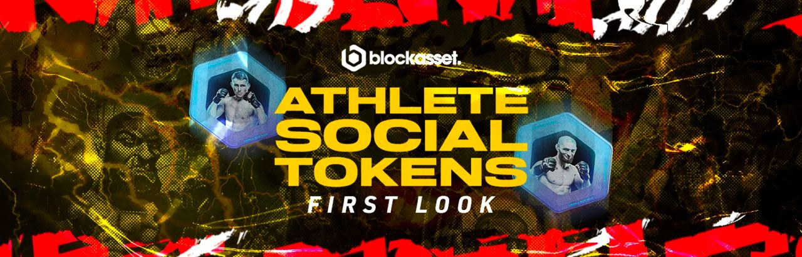
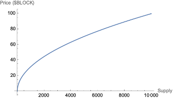

## What is Blockasset?

[Blockasset](https://blockasset.co/) is a platform on Solana for verified athlete tokens and NFTs.
They specialize in social crypto assets for athletes. Athlete tokens on blockasset are a new p2p economy that rewards community engagement and early adopters. Blockasset is pushing the bounds of fan engagement in the sporting world.

Let's take a closer look at these Athlete Tokens, how they work, and how you can get your hands on one.

## What is an Athlete Token?

An athlete token is a subset of social tokens. Owning a social token is like joining a fan club. 
It gives you access to exclusive content, and can be exchanged for priceless experiences. For example, these athlete tokens will give access to training sessions, VIP sporting event tickets, signed merchandise and more.  While an athlete token could increase in value, they are not an investment or security.  Instead, the primary use of an athlete token is to be consumed.   

The value of an athlete token is related to the power of the community behind them.

**`$BLOCK`** is the token of blockasset. You'll use this token to interact with everything in the Blockasset ecosystem, including to purchase these athlete tokens.

## How does it work?

Blockasset is using Strata Protocol to do permissionless launches of their athlete tokens so they are immediately tradable. No need for market makers or LPs. Strata seamlessly handles the supply and liquidity.

While this sounds complex, from a fan perspective it's as easy as clicking "buy".

**tl;dr: The price of the token goes up as tokens are purchased and down as tokens are sold, following a mathematical curve**

This is accomplished using an Automated Market Maker (AMM) called a [bonding curve](https://docs.strataprotocol.com/learn/bonding_curves). 

The best way to visualize this process is with poker chips. Imagine there is a cash register. When you put dollars into the register, the cashier gives you chips (tokens). When you return the tokens, the cashier gives you dollars back. When you give Strata Protocol `$BLOCK`, it gives you Athlete tokens. When you sell them back to the protocol, it gives you `$BLOCK`. The more of the athlete token in circulation, the more `$BLOCK` it costs to purchase a token and the more `$BLOCK` you receive by selling tokens.

Athlete tokens are currently priced on a square root curve. This means the price is related to the square root of the total supply of athlete tokens. Here's a visualization:

The launch day prices may differ, but the curve will have the same shape.

## 🔥 Sponsored Burn 🔥

If the price of a token is related to the number of tokens in circulation, how does burning tokens raise the price?

In a typical `sell` operation, your athlete tokens are burned in exchange for `$BLOCK` tokens. This means that both the supply goes down *and* the amount of `$BLOCK` in the cash register. What happens if you don't take any block from the cash register? This should make all existing athlete tokens worth more `$BLOCK`.

When athlete tokens are burned for experiences, all circulating athlete tokens are backed by more `$BLOCK`. This leads to several innovative tokenomics models.

## Royalties and NFT Holders

When an athlete token is purchased, a percentage of the sale is taken in royalties. This functions similar to NFTs, where a percentage of each sale is sent to the creator. The blockasset team will be routing a portion of these royalties to the athlete, and a portion of the royalties to NFT holders based on rarity. This means that NFT holders
will accumulate athlete tokens which they can exchange for experiences.

## The Fair Launch Window

When an athlete token launches, **the price will be fixed for 30 minutes**. After 30 minutes, the athlete token will gradually transform from fixed price to a square root curve. This results in upward price pressure with increased price sensitivity.

If you would like to learn more about this process, you can read on [here](https://docs.strataprotocol.com/learn/fair_launch)

