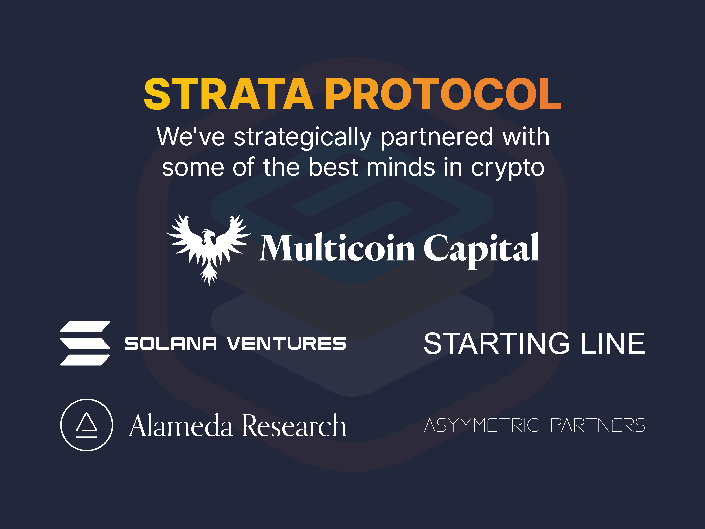

# Strata Raises $1.5 million in a strategic round for the first permissionless token launchpad on Solana

We are thrilled to announce a $1.5 million strategic round for the first permissionless token launchpad on Solana led by Multicoin Capital with participation from Solana Ventures, Starting Line, Asymmetric Partners, and Alameda Research.
 
Several notable angels also participated including:

 * Bill Lee, the co-founder of Craft Ventures
 * Chris McCann, a Partner at Race Capital
 * Saurabh Sharma, a Partner at Jump Crypto
 * Tristan Yver, the Head of Strategy at FTX.
 * Roneil Rumburg and Forrest Browning, founders of Audius

Our funding announcement heralds the [Strata Launchpad](https://app.strataprotocol.com), the first permissionless no-code token builder on Solana. Our Launchpad makes it simple to launch tokens for Creators, GameFi, DAOs and Sub-DAOs as well as a social mesh for creating networks of social tokens. Launching a token should be as easy as launching a website with Shopify or Wix. 

This funding will be used to further build our team as we help the community launch their tokens and expand the use cases for Strata tokens within the ecosystem. We’re hiring in both engineering and business development!

We would also like to thank the Solana community and our advisors for supporting us on this journey.  From the various hackathons and hacker houses to the tireless work from the community on tools and composable protocols, we truly stand on the shoulders of giants.

## Strata Protocol

Strata is the best way for creators, builders, and entrepreneurs to integrate tokens, and novel experiences around tokens, into the heart of their communities. Strata Launchpad, a no-code token builder built using Strata, makes it incredibly easy to create and launch tokens with a few clicks.

Strata has a variety of options for launching social tokens, ranging from fully managed AMMs with frictionless token swaps to Initial Token Offerings (ITOs) using a technical innovation called a Liquidity Bootstrapping Curve (LBC). The LBC is similar to Liquidity Bootstrapping Pools (LBPs) on Ethereum, though notably they do not require any initial liquidity. These technologies enable price discovery and allow for Strata tokens, such as social tokens, gamefi tokens, or sub-DAO tokens, to start trading day one. 

Strata tokens are built for composability. Tokens created with Strata are just normal SPL Tokens with Metaplex token metadata. This means they will work with your existing wallet and can be used out of the box in a wide variety of DeFi protocols. Strata is fully open source, and comes with a suite of developer tools so that you can embed your token anywhere.

Strata ships with a social framework that allows networking interrelated tokens to bind their directional success. Most notably, this framework can be used to create Sub-DAOs where the Sub-DAO token is directionally bound to the parent DAO. Viewed through a social lens, token collectives are a crypto-linked way to create micro economies within a larger organization. Like-minded creators can pool resources together and bond their directional success to other members of the collective.
 
Strata Protocol plans to work with the Solana Ecosystem to facilitate the launch of new tokens and develop them in innovative ways. The ease of our launchpad opens up the token economy to new users facilitating the growth of web3 by lowering the barrier to entry.

Strata Protocol is allowing tokens to be used with previously unexplored utilities. Strata’s diverse toolkit has already enabled platforms such as wum.bo to create social tokens for hundreds of users. GRAPE protocol has created Sub-DAOs using Strata Protocol enabling their community to monetize their skillsets via social tokens. Strata Protocol bounties enabled the Pandas Not Plastic campaign to raise over 1000 Sol for charity. 

## What’s coming next

Integrations! We are going to add support for using your Strata token in a variety of places, from NFT marketplaces to governance and DAOs. 
 
Our goal is to help the community innovate. Want to launch a token but not sure how? Feel free to reach out on twitter and we can help you brainstorm!

## Where to find us:

  * Follow us on [twitter](https://twitter.com/StrataProtocol)
  * Join our [discord](https://discord.gg/XQhCFg77WM)
  * We’re Hiring! Apply [here](https://forms.monday.com/forms/9016285334ffbfb43663341a0da9c2ce?r=use1)
  * Our source code is [here](https://github.com/StrataFoundation/strata)
  * Our audit via SlowMist for the token bonding contract [here](https://www.slowmist.com/en/security-audit-certificate.html?id=94c3d08b11294b00c81e5e0e1799a89ae66d74f16a3026af5e87168df1c835cd)
