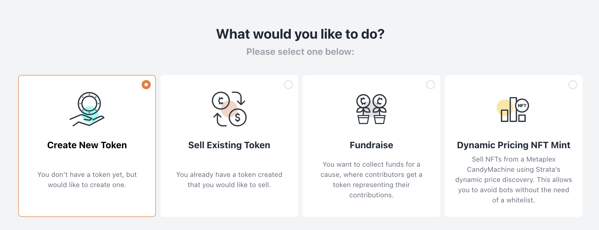
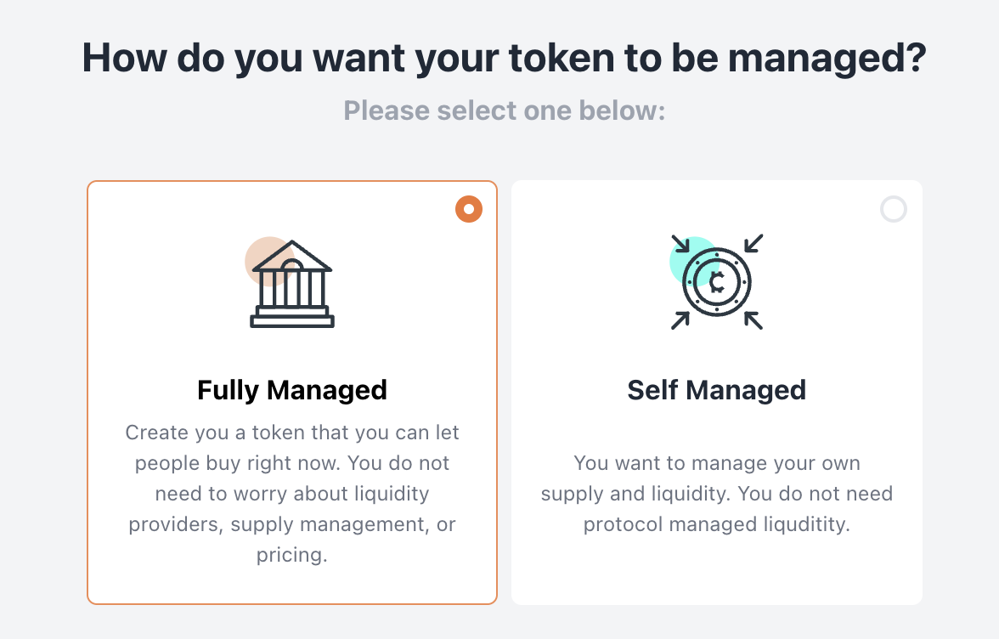
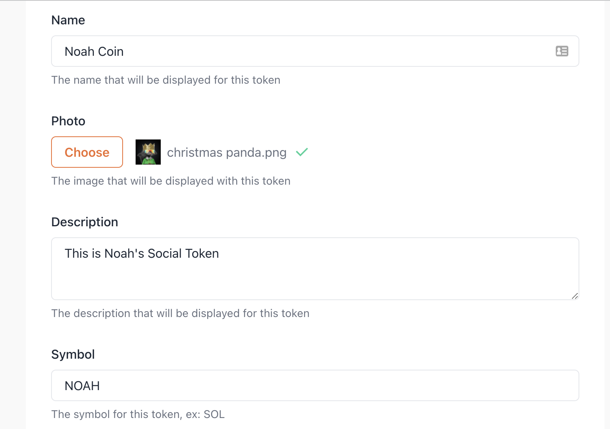
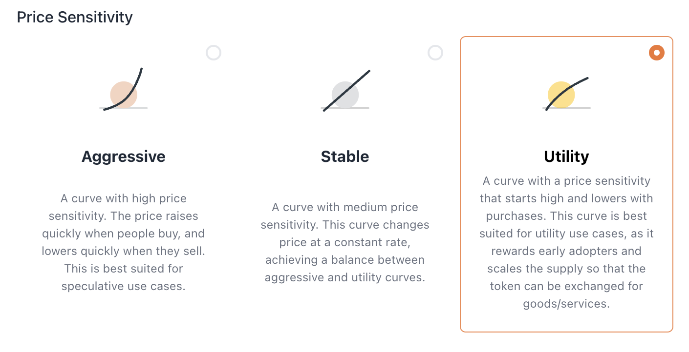
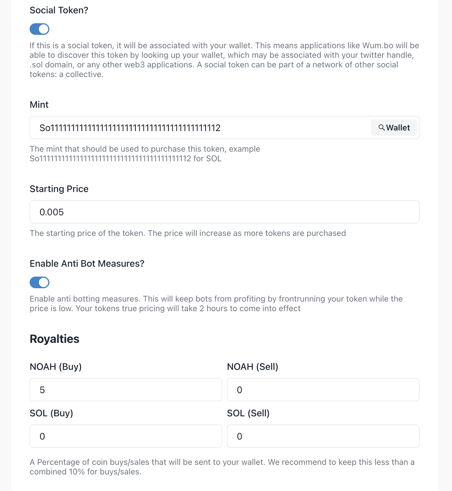
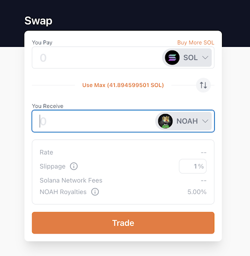
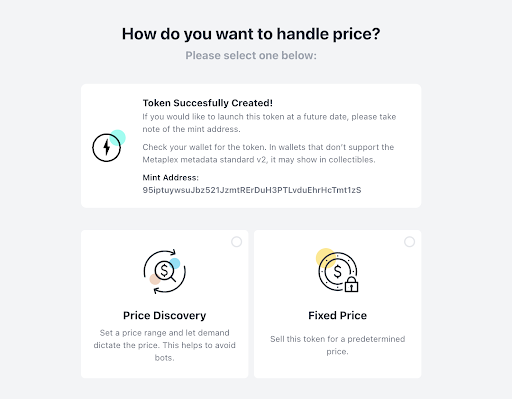
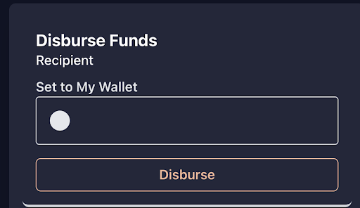

In this article, we'll cover how to create a Solana token on Strata. Launching your own Solana token can be daunting. There are a lot of considerations, and we’ll try to cover those as well.

First, what does it mean to “Create” a token? Creating a Solana token tends to come in 3 steps:

1. Creating the token. How do you actually create a Solana token that will show up in wallets like Phantom, Slope, and Solflare?
2. Distribution. How do you get this token out to the community? How do you sell an initial supply to your community?
3. Liquidity. How does your community continually have the ability to buy and sell this token?

## How to Create a Solana Token Easy Mode - Fully Managed Tokens

Let’s say you do not want to worry about steps 1 through 3. You just want a token that people can buy and sell _right now_. When users put SOL in, they get the token out. You will not manage the token supply or pricing, and will instead take a royalty on sales (similar to an NFT). If you would like to create a token where you manage your own supply, you can skip to [Creating a Token](#step-1-how-to-create-a-solana-token---creating-the-token)

For this article, I’m going to create a Solana Token called NOAH. Since it’s a small token, there’s no guarantee that there will be a counterparty to any trades. Instead, by using a Strata Fully Managed token, the protocol will be the counterparty to every trade.

Head over to the [Strata Launchpad](https://app.strataprotocol.com). Select “Create a Token”

Select Fully Managed:

Fill out the name, description, and photo for this token:

Then, select a price sensitivity. Utility is generally a good place to start.

Next, I'm indicating that this is a Social Token. I want this token to link to my wallet, so that it can be bought and sold in apps like [Wum.bo](https://wum.bo). We’ll use SOL to price this token. When users put in SOL, they’ll get NOAH out.
If this token isn't associated with a person, project, dao, it's fine to leave this toggle off.

Since I have set the royalties to 5% NOAH on Buy, I will get 5% of every NOAH token sale. If there are 100 NOAH tokens minted via the protocol, I will have received 5. I can also take SOL on buy/sell.

Done! You now have a tradable token! You can see this token on devnet [here](https://app.strataprotocol.com/swap/A6EpBzLEPw2CNrz7VWnWJUDLvjMx1KujtWxHYPjJk54m?cluster=devnet).

You can skip the rest of this guide, as it only applies to tokens not having their liquidity managed by Strata.

## How to Create a Solana Token - Self Managed Tokens

A self managed token is one where you decide the supply, and have full control over distribution. You will want to think
about who should have this token, how it gets distributed, and the percentages/amounts for each party. You can see an example of this kind of workup [here](https://www.projectserum.com/serum-token-summary)

### Step 1: How to Create a Solana Token - Creating the Token

This is the easiest part. Head over to the [Strata Launchpad](https://app.strataprotocol.com) and select Create a Token

Select self managed:

Fill out your token’s information like the name, symbol, image, and supply:

Click Create Token. Strata will create the token and you should be able to see it in your wallet.

### Step 2: How to Create a Solana Token - Distribution

You have a token in your wallet, but how do you distribute it? You can send the token to people using your wallet, but what if you want to sell the token? This is called “Liquidity Bootstrapping.” In the previous step, you will have been greeted with a screen like this. If not, you can get to this screen by clicking “Sell a Token” on the launchpad.

Here, you have a choice. Do you want to sell the token with price discovery or for a fixed price?

#### Price Discovery

If you expect the token to be in high demand, this is the best option. This option lets the market and your community decide on a fair price for the token. This uses the Strata [Liquidity Bootstrapping Curve (LBC)](https://docs.strataprotocol.com/marketplace/lbc), which is similar to an LBP on Ethereum. The protocol will sell the token using a process similar to a dutch auction. The price will fall over time, and increase with every purchase. This creates a price discovery, which you can read more on [here](https://docs.strataprotocol.com/marketplace/lbc).

When selling a token with price discovery, the price will float throughout the launch period. You can control the following settings

##### Options

- Starting Price - The starting price when the LBC launches. The price will drop quickly in the beginning and more slowly as time goes on. We suggest you set this price at the highest price you expect the token to sell for. **This is not the maximum price**. If the token is in high demand, it could sell for an average price higher than the starting price.
- Minimum Price - The absolute minimum price you would like to accept for these tokens. The price will never fall below this threshold. A minimum price that is too high may mean that the token does not sell out. **This price should be within 5x of the starting price**. If the starting price is 5 SOL, the minimum price should not be less than 1 SOL. The larger the difference, the faster the price will need to drop.
- Number of Tokens - How many tokens do you want to sell in this LBC?
- Interval - How long should this LBC go on for (in seconds)? This period is the time during which the price will fall. We recommend you set this period long enough so that everyone gets a chance to participate. Windows less than 15 minutes (900 seconds) are not recommended.
- Launch Date - When should the LBC start?

#### Fixed Price

This option sells your token for a fixed price to anyone who visits the sales page. While this leads to predictable liquidity, it is also vulnerable to bots looking to buy your token and flip it on a secondary market. As a general rule of thumb, if your token is in high demand and you expect the fixed price to be less than the aftermarket price, you should use Price Discovery.

#### Bootstrapped Liquidity

After you finish launching your token, you’ll be able to distribute the funds from the sale back to your wallet. When using the wallet that launched this sale, you should see a form like this:

### Step 3: How to Create a Solana Token - Liquidity

Now you have both your token and SOL in your wallet. Your community has tokens which they have purchased. How do you enable trading on this token? The best way to enable trading is via an Automated Market Maker (AMM). The most common form of this is a Swap (think Uniswap). On Solana, you have a lot of options when it comes to swaps. We will do a more in-depth post on this step later, but for now you can look at several different options with some of the features:

- Cykura - [https://cykura.io](https://cykura.io/)
  - Open Source
  - Concentrated liquidity
- Invariant - [https://invariant.app](https://invariant.app/swap)
  - Soon to be open source
  - Concentrated liquidity
- Raydium - [https://raydium.io](https://raydium.io)
  - Closed Source
  - Provides liquidity to a Serum order book
- Atrix - [https://app.atrix.finance](https://app.atrix.finance)
  - Closed Source
  - Provides liquidity to a Serum order book

Let’s say you bootstrapped $200,000 in liquidity with a finishing price of $0.50 per token. After the liquidity bootstrapping is finished, you could go create a pool on any of these services with:

- $100,000 USDC
- 200,000 Your token

This will start the price of the pool out at $0.50 with $100k in liquidity. You can then invite your community to provide additional liquidity on this pool.
