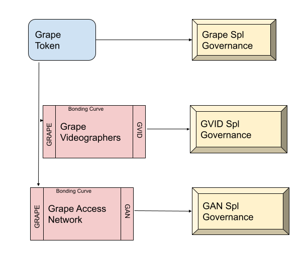

# Solana Composability vs Ethereum Composability - A Deep Dive

A major tenant of blockchain architecture is composability. By sharing state, dApps can create rich interactions that are not isolated to a single walled garden. A token can have uses throughout the ecosystem, not just in a single application.

Solana and Ethereum take vastly different approaches to this problem. In this post, we'll explore the composability patterns on both and the consequences of these design choices.


:::info Background
My background is almost exclusively in Solana development. Ethereum devs, feel free to contribute and correct my understanding where needed.
:::

## Ethereum Composability

Ethereum Composability looks a lot like interface-based inheritance in classical Object Oriented Programming (OOP). Ethereum makes use of a set of *Standards* - Well-defined interfaces for common tasks, such as creating a token. The most well-known standard is the ERC-20 token standard:

```
interface IERC20 {
	function transfer(address to, uint256 value) external returns (bool);
	function approve(address spender, uint256 value) external returns (bool);
	function transferFrom(address from, address to, uint256 value) external returns (bool);
	function totalSupply() external view returns (uint256);
	function balanceOf(address who) external view returns (uint256);
	function allowance(address owner, address spender) external view returns (uint256);
	event Transfer(address indexed from, address indexed to, uint256 value);
	event Approval(address indexed owner, address indexed spender, uint256 value);
}
```

Here's an overview of Ethereum's account structure:


A smart contract (in this case, a single token), resides at a particular address. Both the data and execution logic for that token are stored at that address. For example, the data to find all holders is available at that particular address.

In ethereum, you can compose contracts by storing them in your contract's state:

```
contract FooContract {
	IERC20 myTokenContract;
}
```

Similar to OOP, Ethereum is a system of smart contracts adopting interfaces so that they can interoperate together. "If it quacks like a duck, then treat it like a duck"

## Solana Composability

Solana Composability looks a lot more like Functional Programming (FP). The execution logic for a smart contract (on Solana, called a program) exists separately from the state.

With Solana, data is still stored in accounts, but all of the data for a given program is distributed across multiple accounts. Every account in Solana is owned by a Program. If this were a SQL database, you could get all of the state for a given program by running:

```
SELECT * from solana.accounts WHERE owner = <program_id>
```

Where is a Solana program stored? The compiled code is also stored on accounts. The Solana runtime knows how to execute the binary for these special accounts. You can think of a program call as a function execution over some state.

Since we looked at ERC-20, let's look at spl-token. First, let's take a look at a Token Account:
```
pub struct Account {
    /// The mint associated with this account
    pub mint: Pubkey,
    /// The owner of this account.
    pub owner: Pubkey,
    /// The amount of tokens this account holds.
    pub amount: u64,
    /// If `delegate` is `Some` then `delegated_amount` represents
    /// the amount authorized by the delegate
    pub delegate: COption<Pubkey>,
    /// The account's state
    pub state: AccountState,
    /// If is_native.is_some, this is a native token, and the value logs the rent-exempt reserve. An
    /// Account is required to be rent-exempt, so the value is used by the Processor to ensure that
    /// wrapped SOL accounts do not drop below this threshold.
    pub is_native: COption<u64>,
    /// The amount delegated
    pub delegated_amount: u64,
    /// Optional authority to close the account.
    pub close_authority: COption<Pubkey>,
}
```

This struct will be stored on a solana account for each unique holder of a token. The account is _changed_ via function calls, for example:

```
Transfer {
    /// The amount of tokens to transfer.
    amount: u64,
}
```

There's some major differences to note here:

   * Solana has **one** token program for all of the spl-tokens in existance. Eth has a program for each token.
   * Solana state is stored separately from execution logic.

Composability works via composing functions. I can write a function that takes in an `Account` from the spl-token program, and then calls `Transfer`.

### Solana Composability - Inheritance

Solana Program calls depend on the arity and ordering of account arguments. Making matters more complicated, *every account used by an instruction must be passed to the instruction*. 

The upshot: If my implementation of a function requires more or different accounts than yours, they are *incompatible*. This makes inheritance difficult to impossible.

:::info Lookup Tables
A new feature to Solana, lookup tables, may help alleviate this limitation.
:::

### Solana Composability - State as an Interface

With Solana, the State _is_ the interface. Composition can be broken down into systems of state and actions on that state. What does this mean? If Program A wants to interact with Program B, it can either

   * Directly call Program B
   * Write State that is expected by Program B

The latter has massive implications for composability. Instead of needing to agree on an _action_ based interface, Solana programs can agree on intermediary state. Tokens are the most common form of state.

   * Program A gives the user token A
   * Program B lets the user exchange token A for NFT C

In Solana, Program B is blissfully unaware of Program A. In Ethereum, program B would need a reference to the token program of A.

## Composability Example - Solana vs Ethereum

Let's say you want to mint an NFT such that the price increases for every NFT purchased. The De-Facto way to mint a collection on Solana is the [CandyMachine](https://docs.metaplex.com/candy-machine-v2/introduction).

The problem: The CandyMachine takes a fixed price in either SOL or any SPL token.

On Ethereum, you may extend the interface of the CandyMachine contract and add your pricing logic. On Solana, you could do similar -- fork the candymachine and upload your own program. We're devs, and code duplication is bad! Instead, we can string two programs together!

To achieve this, we can tie a [Strata Bonding Curve](https://docs.strataprotocol.com/learn/bonding_curves) to a [Metaplex Candymachine](https://docs.metaplex.com/candy-machine-v2/introduction). A Strata Bonding Curve allows you to create a pricing system such that every new token minted is more expensive than the one before it.

The integration is straightforward:

  * Step 1. Create a bonding curve with desired pricing characteristics that lets users buy `Token A`
  * Step 2. Create a CandyMachine whose price is `1 Token A`

At minting time, the minting UI:
   * Uses SOL to purchase a Mint Token, `Token A`
   * Uses `Token A` to mint an NFT from the CandyMachine.

The intermediary state between Strata and Metaplex is `Token A`. Importantly, neither the Strata nor Metaplex contracts know about each other.

## Solana vs Ethereum Composability - Consequences

Neither composition strategy is inherently better. As you will find with FP vs OOP, there are plenty of flame wars arguing which is better. There are, however, notable tradeoffs.

### Tradeoffs - Speed

Solana's programming model lends itself to massive amounts of parallelization. Because every piece of state is identified as read-only or writable, the Solana Sealevel runtime is able to run many transactions in parallel knowing that they will not interfere with each other. This is a core tenant of Solana, and why it has a much higher TPS than Ethereum.

### Tradeoffs - UI Compatability

Ethereum's interface model makes it easy for one UI to integrate with multiple smart contracts implementing the same interface. This makes forking considerably easier on Ethereum than it is on Solana. Example: On Ethereum, if you fork Uniswap and match the interface, you will have out-of-the-box support in multiple user interfaces. On Solana, you would only have support if you did not add any accounts to the function signatures. Solana user interfaces tend to be heavily coupled to particular smart contracts. 

### Tradeoffs - Open Source

Neither Ethereum nor Solana has contracts that are open source by default. However, Solana has a good amount of closed source contracts that hinder composability. It is much harder to compose with something when you can't see the code. That being said, there is a strong culture of open source within Solana that is actively pushing for contracts to be open. Strata is, and will always be, open source.

### Tradeoffs - Program Proliferation vs State Proliferation

Ethereum's model leads to _a lot_ more programs and a lot more bespoke code running on chain. This makes it way easier to override behavior (for example, taking fees on token transfers). On Ethereum, forking is easy and encouraged.

Solana's model leads to _a lot_ more state, and programs that act as state changing primitives. This makes it preferable to create chains of logic where generalized contracts interact with other generalized contracts. On Solana, forking adds complexity for any UI-only dApps. This causes a push for well-thought-out battle-tested contracts, like the Metaplex Token Metadata Standard.

### Tradeoffs - Complexity

Solana tends to be more complex from a planning and architecture standpoint. You need to think hard about the state you're outputting, and how it can be used in other contracts. Stringing contracts together can be painful if this is done incorrectly.

With Ethereum, as long as you have a reasonable interface you can get away with ugly state.


## Strata - Composability First

The future of Solana is chains of primitives working together. We can model tokens, and systems of tokens, using various primitives like [Bonding Curves](https://docs.strataprotocol.com/learn/bonding_curves), [Fanout Wallets](https://hydra-docs.glasseaters.xyz), [CandyMachines](https://docs.metaplex.com/candy-machine-v2/introduction), [Governance](https://realms.today/realms), and [Multisigs](https://squads.app/).

For example, using these primitives [Grape](https://grapes.network/) has been able to set up a multifaceted DAO with SubDAOs:



With systems like this, the question shifts from "How do we develop an individual smart contract?" to "How can we compose and orchestrate existing primitives?".

## Interested in Learning More?

  * Join our [Discord](https://discord.gg/XQhCFg77WM)
  * Our source code is [here](https://github.com/StrataFoundation/strata)
  * Follow us on [Twitter](https://twitter.com/StrataProtocol)
  * We’re Hiring! Apply [here](https://forms.monday.com/forms/9016285334ffbfb43663341a0da9c2ce?r=use1)
