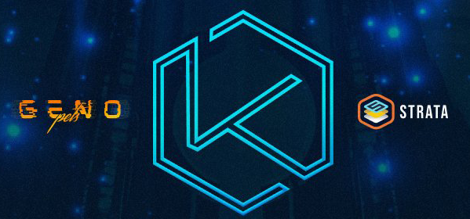
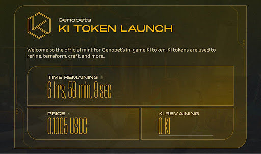
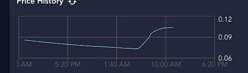

# Genopets sells $1.8M in KI Token to bootstrap liquidity on Strata LBC

As builders, we strive to make history even when the market is bearish. Genopets helped us make history by raising over $1.8 million dollars using our Liquidity Bootstrapping Curve (LBC) for their KI Token launch. We joined forces with the Genopets team to support the launch of their KI token using Solana’s first permissionless liquidity bootstrapping protocol, the Strata Liquidity Bootstrapping Curve. 

Through this liquidity bootstrapping, Genopets were able to create some of the deepest liquidity for their holders on Orca. The project did not collect any funds from this raise, rather, they used the funds to ensure that KI holders could continue trading the token for the foreseeable future. We hope to see many other projects adopting this model to supply liquidity to their holders.

 

Genopets is a project that is familiar with making history. They are the world’s first move-to-earn NFT game. Genopets offers a unique mobile RPG experience with an evolving spirit animal NFT personalized to you. You can battle your pets with friends to earn KI Tokens. These KI Tokens are the all-important in-game utility token for the Genoverse. They can be used for crafting, refining, and terraforming.

## The Launch

Genopets sold out their KI token with nearly 7 hours remaining on their LBC. With no bots or clickfarms, the Genopets team was able to bootstrap liquidity while giving their community a fair price. 

From the outset of the three day launch, there were a good volume of transactions. In the beginning, this demand failed to match the falling price of the LBC. This is standard in an auction, as the price is meant to fall to the fair price. 

The auction started at a price of $0.50 cents, accompanied by a gradual fall to between $0.07 and $0.11. In the graph below, you can see the moment the fair price range was discovered. After about 2 days, demand started to match the fall in price, and in the graph below, you can see the demand spiked when participants saw a great price. 

Using Orca.so, the Genopets team created an Automated Market Maker with a pool using the $1.8 million raised. The price discovery mechanism enabled the Genopets team to find the true value of their token by bootstrapping that liquidity raised via price discovery directly from the LBC right into an Orca liquidity pool. 

We would like to congratulate our friends at Genopets on a smooth and successful sellout of the KI Token, as well as the Genopets community for their new KI tokens! We also love the phenomenal custom UI skin the team created for their LBC launch. This custom skin demonstrates the ability to customize the underlying components of Strata to fit your needs.

We look forward to making more blockchain history, and seeing the new ground that the Genopets team is sure to break. If you wish to launch a token or an NFT project with Dynamic Pricing, you can use our launchpad at app.strataprotocol.com. If you need any assistance feel free to hop into our discord and we’ll help you set it up. 
