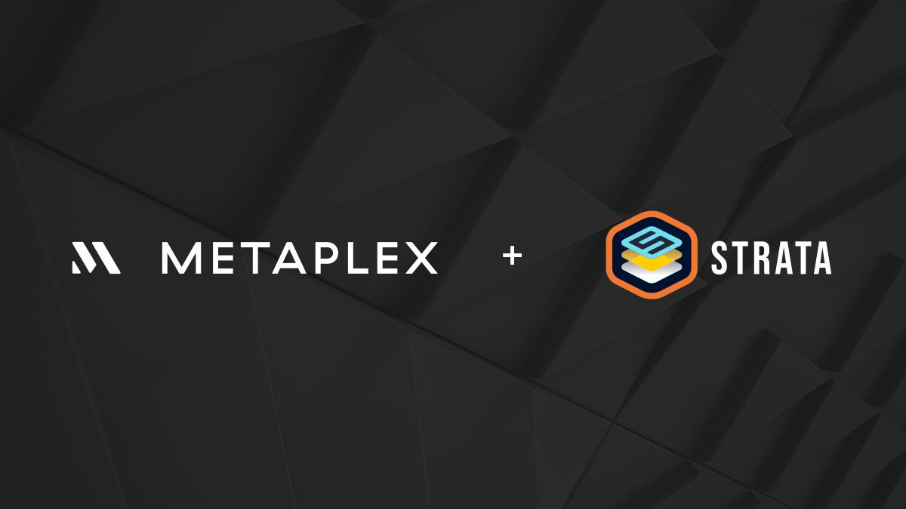
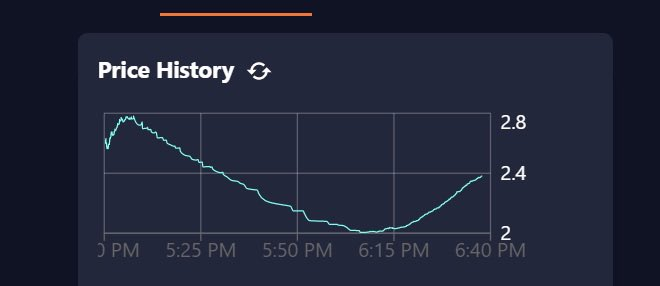

# Strata and Metaplex partner to bring community driven pricing to public mints

Today we’re excited to announce a new partnership with our friends at Metaplex that natively integrates Strata’s Liquidity Bootstrapping Curves (LBCs) into Metaplex’s CandyMachine creation process, 
bringing dynamic, community-driven pricing to public mints and a better user experience for creators and collectors alike. 
LBC mints are live today. Read the [docs](https://docs.strataprotocol.com/launchpad/dynamic-pricing-mint) or watch this [video](https://www.youtube.com/watch?v=i28CwS1QYAo) to learn how to use it.

Since the days of yore (read: 1 year ago), minting NFTs on Solana has been done with a fixed price. 
NFT Collections set a supply and a price, and hope that they sell out. When the SOL community was small, 
this methodology worked well. With increasing attention, mispriced mints have led to headaches for everyone
involved and the network itself.

An overpriced mint will not sell out, forcing projects to cut their collections short.
An underpriced mint invites hoards of bots that can clog, and in extreme cases stop, the Solana network.
Add to this situation that projects are now being listed on exchanges during the mint, and you have a recipe for disaster. Price discovery is happening anyway, and the profits are going entirely to flippers and bots.

The solution: Dynamic Pricing. By partnering with Metaplex, we are pushing price discovery to be the new default
for public mints. While whitelist mints can still be fixed price, price discovery is a necessity for public mints.
Price discovery during the mint means that there is no advantage to spamming transactions or clicking “mint” before
someone else. During a Dynamic Pricing Mint, the price floats according to supply and demand. As a minter,
you decide what price you are willing to enter. As a creator, the proceeds of the price discovery help fund
the project instead of short-term flippers.

## How does Dynamic Pricing work?

Imagine you are auctioning an item, but you do not know what it is worth. A good auctioneer will first establish
a baseline price, then let participants bid the price up. The price starts high, falls until someone bids,
then rises with every bid. For example, if we were auctioning a grill, the auctioneer may start the price at $1000.
Then $500. Then $200, where someone makes a bid. From there, the price may be increased through bidding to $350.

How can this work with an NFT collection instead of a single item? The Strata Protocol LBC (Liquidity Bootstrapping Curve)
does this by setting a starting price that falls over time and increases with each purchase. 

As an example, let’s take a look at the [Divine Dogs](https://www.divinedogsnft.com/) Dynamic Pricing mint.
Based on previous mints, the team estimated that the collection would sell out completely for somewhere between
2 and 2.5 SOL. Thus, they set a starting price of 3.3 SOL and a minimum price of 1.1 SOL. The plot below is the
actual sales history of the mint.

The price fell to around 2.6 SOL, followed by large demand from minters who thought the NFT was worth 2.6 SOL.
As the price ran up, more minters bought, driving it up further. At 2.8 SOL, demand normalized and the price
began to even out. The jagged lines down to 2 SOL show the users trying to time the dip.
At 2 SOL—likely a psychological number—we can see the price rose rapidly as minters assumed the current price was
the lowest they would see. 

## The Strata + Metaplex Partnership 

We’re huge fans of Metaplex and already built a way to create dynamic pricing mints on Metaplex Candymachines,
but the experience is far from seamless. 

The goal of this partnership is to drastically lower the barrier to entry to dynamic pricing mints,
hopefully making the LBC mint mechanism a default for creators, collectors, and the Solana Network at large.
The partnership will support deep, native integration in Metaplex including updates to the metaplex CLI and
documentation that make dynamic pricing the default for public mints. Metaplex believes, as do we,
that dynamic mints are ultimately better for creators, collectors, and the Solana Network. 

## Better for Creators,Collectors, & Solana 

The dynamic pricing model is more equitable for both creator and collectors. Using this mint method
collectors have a fairer chance to mint, the community incentivises collectors that are long-term holders vs.
short-term flippers, and creators usually end up raising more money through effective, community-driven price discovery. 

### A Fair Chance to Mint

During a fixed price mint, the average collector does not stand a chance at minting a NFT.
Professional scalpers deploy bots that submit millions of transactions while the average retail
collector can usually only submit a handful. Even with anti-botting strategies, click farms stand a
far better chance at minting NFTs than the intended minters.

With dynamic pricing, every mint participant has a fair chance to mint at a price they deem fair.
This is a step-function improvement in inclusion and accessibility for mints that radically expands
participation from the hands of the elite few to a true-fan community of many.

### Disincentivize NFT Scalpers

A classic NFT mint works a lot like concert ticket sales. Scalpers take the majority of the tickets
and resell them to true fans, who are forced to pay a premium. The artist sees none of those profits.

With NFT communities, this situation is even worse because, in addition to creators getting harmed,
the Solana Network is also spammed by bots and flippers trying to make a quick score. An NFT community seeks long 
term holders. True believers that want to see the project succeed long term. The Strata LBC combined with Metaplex makes
it easy to disincentivize NFT scalpers and incentivize long-term community members.

### Creators Can Earn More 

Creators have the potential to earn more using Strata’s Dynamic Mints in Metaplex. Creators do the heavy lift
to bootstrap communities, and we think they should be rewarded for it—but not at the expense of the community.
Since the money that would be going to bots is now going to the creators, projects will have a better chance to achieve
their funding goals—from a more qualified community base. 

This should, in theory, make projects more likely to succeed by aligning the interests of creators and collectors.

### Better for Solana 

At the end of the day, minters are not the only victims of botters. Botting is clogging the network and will continue
to do so unless something changes. Botters take advantage of the fact that mints are first-come-first-serve at a discount
price. They submit millions of transactions so they have a better chance of being selected to receive the discount.
With a dynamic pricing mint, this kind of behavior would only drive up the price and hurt the bots.
As a result, bots are disincentives to participate, which improves the performance of the Solana Network for everyone.   

## Get Started 

Jump into our docs [here](https://docs.strataprotocol.com/launchpad/dynamic-pricing-mint) to learn more or watch the following video, which shows setting up a dynamic pricing mint with
a whitelist: https://www.youtube.com/watch?v=i28CwS1QYAo

  * Follow [Strata](https://twitter.com/StrataProtocol) and [Metaplex](https://twitter.com/metaplex) on Twitter
  * Join the [Strata](https://discord.gg/XQhCFg77WM) and [Metaplex](https://discord.gg/metaplex) Discords
  * Our source code for this integration is [here](https://github.com/StrataFoundation/strata/tree/master/packages/marketplace-ui/src/components/lbc/mint)
