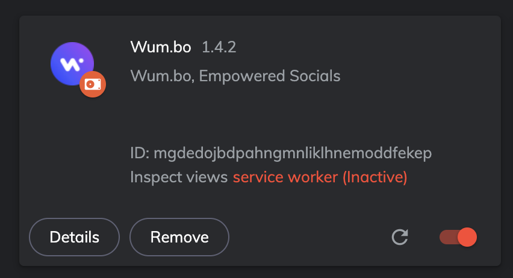
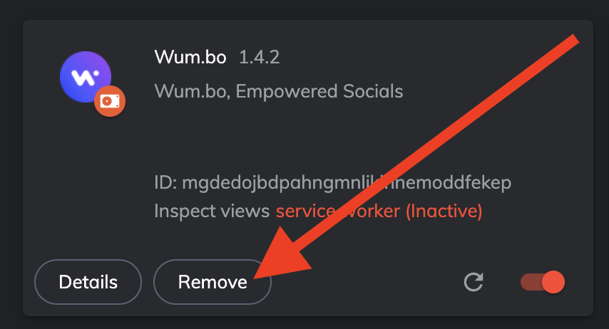

# Strata has decided to sunset Wum.bo

Today we're sad to announce that, after multiple conversations and contemplation amongst the team, we have decided it is time to sunset Wum.bo.

If you participated in Wumbo/OPEN, you should use the following interface to recoup your SOL.

Everyone who participated can claim a share of the reserves of the Open Collective. 
This works because $OPEN uses a bonding curve directly to SOL, and team never took a cut of $OPEN (it had 0% royalties).
As of writing this, $OPEN has
around ~$166k worth of SOL in its reserves. This sol will be split evenly for each $OPEN.
 We have made $OPEN, along with every social token based on $OPEN, a fixed price bonding curve. There is no advantage to cashing out before anyone else.

For example, if there were 100 SOL in the $OPEN reserves, and 1000 $OPEN tokens, each $OPEN holder would be elligible to claim 0.1 SOL.

Thanks for giving Wumbo a try. Our team greatly appreciates you and your early support!

import { CloseOutWumbo } from "@site/src/components/CloseOutWumbo";

<CloseOutWumbo />

Wumbo was our first foray into building on Solana and we learned a lot. In solving the challenge of launching Social Tokens
on Solana, we found we needed to solve launching tokens in general on Solana. This caused us to create Strata, which has greatly
improved the experience for launching and offering tokens on Solana. With this, the team opened ourselves up to more than just Social Tokens.
GameFi tokens, NFT project tokens, bounties for collective efforts, DAOs, subDAOs the list goes on.

Unfortunately, of all of the token types, social tokens have seen the least adoption. Across the board
Social Tokens have struggled to find product market fit.

As such, we have decided to sunset Wum.bo to focus our work elsewhere. There were multiple facets to this decision,
but the main considerations were a lack of adoption, the team not having the proper skillsets to push adoption, utility, and lingering
questions about the role of individuals vs communities in tokenized economies.

### The Team

The success or failure of Wum.bo is ultimately on us, the team. We failed to deliver the revolutionary application
that we had hoped to deliver.

The Wum.bo and Strata team has some of the best builders on Solana. We do not, however, have the kind of marketing and infleuncer
relationships that can find PMF for Social Tokens. Our original thinking was to make social tokens so accessible that
fans could lead the charge. After watching Bitclout, this seemed a reasonable approach. Give the community the ability
to leverage tokens, and similar to what we saw with NFTs, wait for a wave of innovation. This wave of innovation
never came, which meant we needed to push the innovation. That brings us to utility.

### Utility

Without utility, social tokens struggle to gain traction. While speculation held during the early days of social tokens, yielding massive hype as in Bitclout,
eventually speculation fails. We ran several experiments from 1/1 art raffles, to bounties that allow you to sell and crowdsource your time,
to token gated chatrooms. None of these saw increased adoption, usage, or utility in social tokens.

### Community vs Individual

The main issue when pitching Social Tokens to creators was that, to them, asking fans to buy their token felt like asking for charity.

Creators did not want to ask their fans to buy a self-serving token. It is one thing to ask your community to buy into a project,
another completely to ask them to buy a token in your likeness. The future of Social Tokens likely will not revolve
around individuals, but instead around communities and small projects. More and more brands, DJs, and personalities
are opting to launch NFT collections. These share a lot of the same vision of the "Social Token Revolution" that we had
envisioned.

Sometimes technology accomplishes your vision, but in a different way than you had expected.

## Going Forward

The team is taking a hard look at everything we are working on, and re focusing on what matters. Thank you for joining us on this
journey with Wum.bo!

### Wum.bo extension uninstall instructions

• Navigate to chrome://extensions/

• Locate the card for the Wum.bo extension

• Click the remove button and follow any additional prompts

