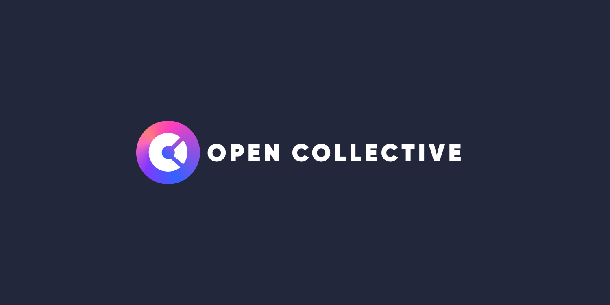

# Buy OPEN

If you have been following closely to our small corner of the web you should be familiar with the Open Collective and the utility OPEN provides. If not, you can read more about it [here](https://blog.strataprotocol.com/open-collective)

In short, Open Collective is the default collective of the Strata Protocol. And OPEN is the token for this collective. Any token made on Strata that isnt directly bonded to SOL, USDC, or any other cryptocurrency will be automatically bonded to OPEN by default.

The bonding curve for OPEN will become unfrozen at 9:00AM UTC Today. It is setup in a way to provide a [fair launch](https://blog.strataprotocol.com/open-collective#open-fair-launch) to all who participate in the early moments of its price discovery. If you would like be one of those participates, please ensure you have a Solana wallet and have funded it with SOL. After that, all you need to do is wait for the curve to become unfrozen and utilize the UI below.

import { BuyOpen } from "@site/src/components/BuyOpen";

<BuyOpen />

The OPEN token will launch on a bonding curve with the formula $$P = c * S^k$$

The parameters for the **OPEN** fair launch are as follows.

- **First 6 hours** of launch the curve price remains fixed $$P = 0.005$$
- **6 hours** after launch there will be a 9.09091% bump $$P \approx c * S^{(1/10)}$$
- **12 hours** after launch there will be a 7.57576% bump $$P \approx c * S^{(1/5)}$$
- **24 hours** after launch there will be a 8.33333% bump $$P \approx c * S^{(1/3)}$$
- **36 hours** after launch there will be a 8.33333% bump $$P \approx c * S^{(1/2)}$$
- **Beyond 42 hours** the curve will have reached its final slope

Whenever the bonding curve steepens resulting in an increase in price, there is a temporary tax imposed on selling. This removes incentive for bots to pump & dump the launch
