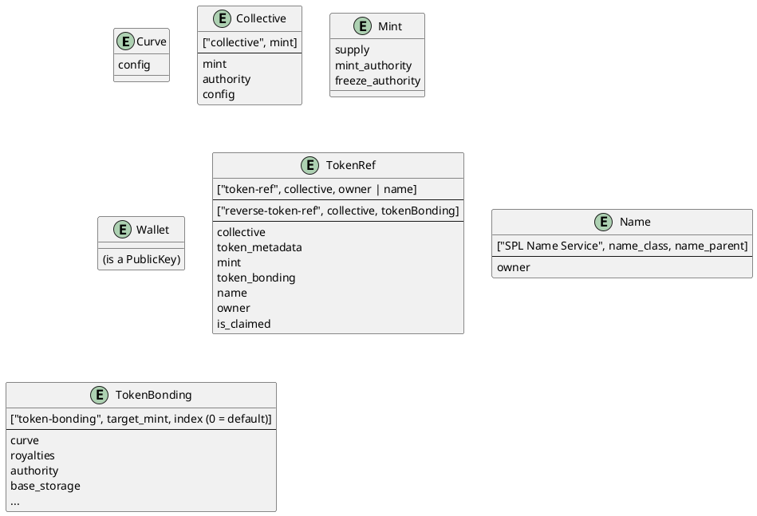

# Social Tokens

A social token is actually like one large join-table. It is the intersection of

  * A collective
  * An owner's wallet
  * A token mint
  * Token metadata (name, symbol, etc)
  * A bonding curve for that token

As such, the protocol has no SocialToken struct; as the token itself is the Social Token. Instead, the protocol has a `TokenRef`. The following [Entity Relationship Diagram (ERD)](https://plantuml.com/ie-diagram) shows the state structures on chain 



# Creation

Let's create a Social Token as part of a new collective.

First, create a collective:

```js async name=collective
// Create a simple exponential curve 0.001 sqrt(S)
var curve = await tokenBondingSdk.initializeCurve({
    config: new ExponentialCurveConfig({
    c: 0.001,
    b: 0,
    pow: 1,
    frac: 2
  })
});

// Create a collective around the Target of the above token bonding
var { collective, tokenBonding } = await tokenCollectiveSdk.createCollective({
  bonding: {
    curve,
    baseMint: new PublicKey("So11111111111111111111111111111111111111112"),
    targetMintDecimals: 2,
    buyBaseRoyaltyPercentage: 5,
    buyTargetRoyaltyPercentage: 5,
    sellBaseRoyaltyPercentage: 0,
    sellTargetRoyaltyPercentage: 0
  },
  authority: publicKey,
  config: {
    isOpen: true
  }
});

var collectiveAcct = await tokenCollectiveSdk.account.collectiveV0.fetch(collective);
var collectiveBondingAcct = await tokenBondingSdk.account.tokenBondingV0.fetch(tokenBonding);
```

Now, create a social token within the collective:

```js async name=token deps=collective
var { tokenRef, tokenBonding } = await tokenCollectiveSdk.createSocialToken({
  curve,
  collective,
  tokenName: "My Test Token",
  symbol: "TEST",
  ignoreIfExists: true, // If a Social Token already exists for this wallet, ignore.
  tokenBondingParams: {
    buyBaseRoyaltyPercentage: 0,
    buyTargetRoyaltyPercentage: 5,
    sellBaseRoyaltyPercentage: 0,
    sellTargetRoyaltyPercentage: 0
  }
});

var tokenBondingAcct = await tokenBondingSdk.account.tokenBondingV0.fetch(tokenBonding);
var tokenRefAcct = await tokenCollectiveSdk.account.tokenRefV0.fetch(tokenRef);
```

## Unclaimed Creation

Now, let's add an unclaimed token to the collective. You can read more about unclaimed tokens in [collectives](./collectives)

First, create a testing top level domain. Note that the name does not have to exist yet for us to create a token:

```js
import { createNameRegistry, getHashedName, getNameAccountKey, NameRegistryState } from "@solana/spl-name-service";
```

```js async name=name
var nameStr = "test-" + publicKey.toBase58();
var hashedName = await getHashedName(name);
var name = await getNameAccountKey(hashedName, publicKey)
```

Now, let's create an unclaimed social token 

```js async name=unclaimed deps=collective,name
var { tokenRef, tokenBonding } = await tokenCollectiveSdk.createSocialToken({
  curve,
  collective,
  name, // Associate the social token with the created name
  tokenName: "My Test Token",
  symbol: "TEST",
  ignoreIfExists: true, // If a Social Token already exists for this name, ignore.
  tokenBondingParams: {
    buyBaseRoyaltyPercentage: 0,
    buyTargetRoyaltyPercentage: 5,
    sellBaseRoyaltyPercentage: 0,
    sellTargetRoyaltyPercentage: 0
  }
});
```

Now, let's create the name with ourselves as the owner
```js async name=create_name deps=name
if (!(await connection.getAccountInfo(name))) {
  var nameTx = new Transaction()
  nameTx.instructions.push(
    await createNameRegistry(
      connection,
      nameStr,
      NameRegistryState.HEADER_LEN,
      publicKey, // payer
      publicKey, // owner
      10000000,
      publicKey // class
    )
  )
  await provider.send(nameTx);
}
```