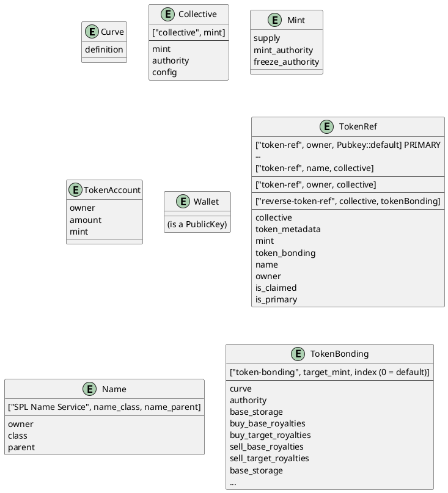

# Social Tokens

A social token is actually like one large join-table. It is the intersection of

  * A collective
  * An owner's wallet
  * A token mint
  * Token metadata (name, symbol, etc)
  * A bonding curve for that token


## State

Strata has no SocialToken struct; as the token itself is the Social Token. Instead, strata has a `TokenRef`. The following [Entity Relationship Diagram (ERD)](https://plantuml.com/ie-diagram) shows the state structures on chain 



# Creation

Let's create a Social Token as part of a new collective.

First, create a collective:

```js async name=collective
// Create a simple exponential curve 0.001 sqrt(S)
var curve = await tokenBondingSdk.initializeCurve({
    config: new ExponentialCurveConfig({
    c: 0.001,
    b: 0,
    pow: 1,
    frac: 2
  })
});

// Create a collective around the Target of the above token bonding
var { collective, tokenBonding } = await tokenCollectiveSdk.createCollective({
  // Commented to avoid uploading to arweave. You should always include this.
  // metadata: {
  //   name: "My Collective",
  //   symbol: "tCOLL", 
  //   image: "https://ibb.co/sRpBwYh",
  //   // Because this is dev, we need to provide the metaplex dev upload file url
  //   uploadUrl: "https://us-central1-principal-lane-200702.cloudfunctions.net/uploadFile2"
  // },
  bonding: {
    curve,
    baseMint: new PublicKey("So11111111111111111111111111111111111111112"),
    targetMintDecimals: 2,
    buyBaseRoyaltyPercentage: 5,
    buyTargetRoyaltyPercentage: 5,
    sellBaseRoyaltyPercentage: 0,
    sellTargetRoyaltyPercentage: 0
  },
  authority: publicKey,
  config: {
    isOpen: true,
    unclaimedTokenBondingSettings: {
      buyTargetRoyalties: {
        // This account is owned by the name service name, and will be transferred to the person who claims this token
        ownedByName: true
      }
    }
  }
});

var collectiveTokenBonding = tokenBonding;
var collectiveAcct = await tokenCollectiveSdk.account.collectiveV0.fetch(collective);
var collectiveBondingAcct = await tokenBondingSdk.account.tokenBondingV0.fetch(tokenBonding);
```

Now, create a social token within the collective:

```js async name=token deps=collective
var { tokenRef, tokenBonding } = await tokenCollectiveSdk.createSocialToken({
  isPrimary: false, // Creates a social token explicitly associated with the collective by pda, instead of the wallet alone.
  curve,
  collective,
  tokenName: "My Test Token",
  symbol: "TEST",
  ignoreIfExists: true, // If a Social Token already exists for this wallet, ignore.
  tokenBondingParams: {
    buyBaseRoyaltyPercentage: 0,
    buyTargetRoyaltyPercentage: 5,
    sellBaseRoyaltyPercentage: 0,
    sellTargetRoyaltyPercentage: 0
  }
});

var tokenBondingAcct = await tokenBondingSdk.account.tokenBondingV0.fetch(tokenBonding);
var tokenRefAcct = await tokenCollectiveSdk.account.tokenRefV0.fetch(tokenRef);
```

Notice that we created a non-primary social token here. Most wallets will have one social token. For ease of lookup, social tokens refs are a PDA of the owner alone. In the case where one wallet belongs to several collectives, they should choose one `isPrimary` token that is used for lookups on storefronts. 

## Unclaimed Creation

Now, let's add an unclaimed token to the collective. You can read more about unclaimed tokens in [collectives](./collectives)

First, create a testing name. Note that the name does not have to exist yet for us to create a token:

```js
import { createNameRegistry, getHashedName, getNameAccountKey, NameRegistryState } from "@bonfida/spl-name-service";
import { Keypair } from "@solana/web3.js";
```

```js async name=name
var nameOwner = Keypair.generate();
var nameStr = "test-" + nameOwner.publicKey.toBase58();
var hashedName = await getHashedName(nameStr);
// Create a name with our wallet as the name class
var name = await getNameAccountKey(hashedName, publicKey)
```

Now, let's create an unclaimed social token 

```js async name=unclaimed deps=collective,name
var { tokenRef, tokenBonding } = await tokenCollectiveSdk.createSocialToken({
  curve,
  collective,
  name, // Associate the social token with the created name
  tokenName: "My Test Token",
  symbol: "TEST",
  ignoreIfExists: true, // If a Social Token already exists for this name, ignore.
  tokenBondingParams: {
    buyBaseRoyaltyPercentage: 0,
    buyTargetRoyaltyPercentage: 5,
    sellBaseRoyaltyPercentage: 0,
    sellTargetRoyaltyPercentage: 0
  }
});
var tokenBondingAcct = await tokenBondingSdk.account.tokenBondingV0.fetch(tokenBonding);
```

Now, let's create the name with the new wallet as the owner
```js async name=create_name deps=name
if (!(await connection.getAccountInfo(name))) {
  var nameTx = new Transaction()
  nameTx.instructions.push(
    await createNameRegistry(
      connection,
      nameStr,
      NameRegistryState.HEADER_LEN,
      publicKey, // payer
      nameOwner.publicKey, // owner
      10000000,
      publicKey // class
    )
  )
  var txid = await provider.send(nameTx);
}
```

Buy some of the unclaimed coin. This should result in 5% royalties accumulated into a temporary account. Here we can use the Instructions modifier to group these buy calls together:

```js async name=buy deps=unclaimed
var { instructions, signers } = await tokenBondingSdk.buyInstructions({
  tokenBonding: collectiveTokenBonding,
  desiredTargetAmount: 10,
  slippage: 0.05
});
var { instructions: sellInstructions, signers: sellSigners } = await tokenBondingSdk.buyInstructions({
  tokenBonding: tokenBonding,
  baseAmount: 10,
  slippage: 0.05
});
var tx = new Transaction();
tx.add(...instructions, ...sellInstructions);
await provider.send(tx, [...signers, ...sellSigners]);
var royaltiesBalance = (await connection.getTokenAccountBalance(tokenBondingAcct.buyTargetRoyalties)).value;
```

Now, let's have the user claim the social token. We should see the funds move to their Associated Token Account:

:::tip Owned By Name
When creating a collective that allows unclaimed tokens, be sure to include the `ownedByName` field in the royalties configuration for every account you want to transfer to the name owner.
:::

```js async name=claim deps=buy,create_name
var { instructions, signers } = await tokenCollectiveSdk.claimSocialTokenInstructions({
  tokenRef,
  owner: nameOwner.publicKey,
  symbol: "CLM",
});
var tx = new Transaction();
tx.add(...instructions);
await provider.send(tx, [nameOwner]);

var balance = await getAssociatedAccountBalance(connection, nameOwner.publicKey, tokenBondingAcct.targetMint);
```