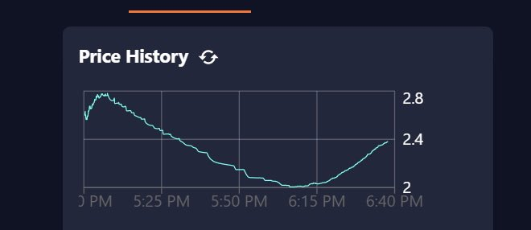

# Dynamic Pricing Mints

Using the Strata [Liquidity Bootstrapping Curve (LBC)](./lbc), you can run an NFT mint that keeps out bots and allows for price discovery.
For a deep dive on this price discovery mechanism, read more [here](./lbc).

With a Strata Dynamic Pricing Mint, the price starts high, and falls until there is demand for the token. From there, it continues to be pulled downward,
but reaches a balance at the fair price where continued demand matches the fall in price.



Above you can see a real-life dynamic pricing mint, and how the price changed over time.

## Dynamic Pricing Mint - Deployment

You can see a video of this in action: [Deploying a Dynamic Pricing Mint with a Whitelist in less than 10 minutes](https://www.youtube.com/watch?v=i28CwS1QYAo)

The easiest way to deploy a dynamic pricing mint is via our [launchpad](https://app.strataprotocol.com). Click the dynamic pricing mint option,
enter your existing candymachine ID, and it will deploy you a UI and update your configuration into that of a dynamic pricing mint.

You can always visit a dynamic pricing candymachine at `https://app.strataprotocol.com/lbcs/mint/:candyMachineId`

### Configuration Parameters

- **Start Date** - The start date should be **at** or **after** the candymachine start date. Otherwise, the UI could cause users to be penalized as bots
- **Supply** - The number of NFTs to sell with dynamic pricing. This should be **at** or **below** the total amount in the candymachine. Selecting a number above the CM supply could lead to users who purchased an NFT but did not get one
- **Start Price** - What price should the mint start at? You should set this to just above the price you expect to sell your NFT. Note that the price can float above this number if there is enough demand.
- **Minimum Price** - What is the minimum price you would accept? Setting this too high can lead to not selling out. The `startPrice` should not be more than 5x the `minPrice` or the price will drop steeply at the beginning of the mint.
- **Interval** - How long should this LBC last for? For mints, it is recommended to use 1-3 hours. Note that minting will remain open after the interval is over, but the price will no longer fall.

Don't have an existing candymachine? Read the [metaplex docs](https://docs.metaplex.com/candy-machine-v2/creating-candy-machine) on how to launch one.

## Dynamic Pricing Mint - Behind the Scenes

Behind the scenes a Dynamic Pricing mint is two pieces of technology composed together.

- A Strata Protocol [LBC](./lbc) that outputs a mint token
- A Metaplex [Candymachine](https://docs.metaplex.com/candy-machine-v2/creating-candy-machine) that takes the mint token as its price.

:::note Non-CandyMachine mint contracts
The Strata LBC is meant to be composed with any contract that can accept an spl-token as payment. This means you can plug and play
the Strata LBC with any other contract that takes a fixed price, not just NFT mints.
:::

When you create a dynamic pricing candymachine via our launchpad, it updates your candymachine config to have:

```
{
  ...,
  "price": 1.0,
  "splToken": "<LBC Output Token>",
  "splTokenAccount": "<Graveyard Token Account, as these tokens are no longer needed>"
  ...
}
```

The [Strata Mint Site](https://github.com/StrataFoundation/strata/blob/master/packages/marketplace-ui/pages/lbcs/mint/[candyMachineId].tsx) runs the
`spl-token-bonding buy` command before executing the candymachine instruction.

All UI components used on this page can be imported from `@strata-foundation/marketplace-ui`. This allows you to deploy your own custom themed mint site if desired.

## Dynamic Pricing Mint - Advanced Usage

It is often the case that you want to run a mint in multiple stages. For example, starting with a whitelist or presale mint.

The best way to do this is to pre-create your LBC, get the mint address, then hook it up to your candymachine after the presales.

import { NetworkSelect } from "@site/src/components/NetworkSelect";

<NetworkSelect />

First, let's create the LBC:

```js async name=lbc
var { targetMint, tokenBonding } =
  await marketplaceSdk.createLiquidityBootstrapper({
    metadata: new DataV2({
      // Max name len 32
      name: "Candymachine Mint Token",
      symbol: "MINT",
      uri: "",
      sellerFeeBasisPoints: 0,
      creators: null,
      collection: null,
      uses: null,
    }),
    baseMint: NATIVE_MINT,
    startPrice: 1, // 1 SOL
    minPrice: 0.3, // 0.3 SOL,
    interval: 2 * 60 * 60, // Number of seconds, this is 2 hours.
    maxSupply: 100, // How many tokens will be sold using the LBC
    bondingArgs: {
      targetMintDecimals: 0,
      goLiveDate: new Date(),
      sellFrozen: true,
    },
  });
```

You may want to save this tokenBonding address and targetMint key for later.

Now, let's create a token account for the graveyard:

```js async name=ata deps=lbc
const graveyard = new PublicKey("gravk12G8FF5eaXaXSe4VEC8BhkxQ7ig5AHdeVdPmDF");
const graveyardAta = await Token.getAssociatedTokenAddress(
  ASSOCIATED_TOKEN_PROGRAM_ID,
  TOKEN_PROGRAM_ID,
  targetMint,
  graveyard,
  true
);
await sendInstructions(
  new Map(),
  provider,
  [
    Token.createAssociatedTokenAccountInstruction(
      ASSOCIATED_TOKEN_PROGRAM_ID,
      TOKEN_PROGRAM_ID,
      targetMint,
      graveyardAta,
      graveyard,
      publicKey
    ),
  ],
  [],
  publicKey
);
```

Now, you can update your candymachine with the following, when you are ready to do a dynamic mint:

```jsx async deps=ata
var splToken = targetMint;
var splTokenAccount = graveyardAta;
var price = 1.0;
```

## Withdrawing Funds

You can withdraw funds at the url generated for you on the launchpad, or you can do so programmatically using the tokenBonding
key you saved earlier.

The `authority` param (defaulted to the wallet creating the LBC) is allowed to withdraw the bootstrapped liquidity from
the curve. This is done via the `transferReserves` command.

```js async deps=lbc
await tokenBondingSdk.transferReserves({
  tokenBonding,
  amount: 0.001,
  destinationWallet: publicKey,
});
```

You can also close and permanently shutdown the mint via `close`, which can only be done when the reserves are empty. This will
recover the rent fees stored in the curve.

```js
import { getAssociatedAccountBalance } from "@strata-foundation/spl-utils";
```

```js async deps=lbc
var tokenBondingAcct = await tokenBondingSdk.getTokenBonding(tokenBonding);
var transferInstrs = await tokenBondingSdk.transferReservesInstructions({
  amount: (
    await provider.connection.getTokenAccountBalance(
      tokenBondingAcct.baseStorage
    )
  ).value.uiAmount,
  destinationWallet: publicKey,
  tokenBonding,
});
var { instructions, signers } = await tokenBondingSdk.closeInstructions({
  tokenBonding,
});
await tokenBondingSdk.sendInstructions(
  [...transferInstrs.instructions, ...instructions],
  [...transferInstrs.signers, ...signers]
);
```
