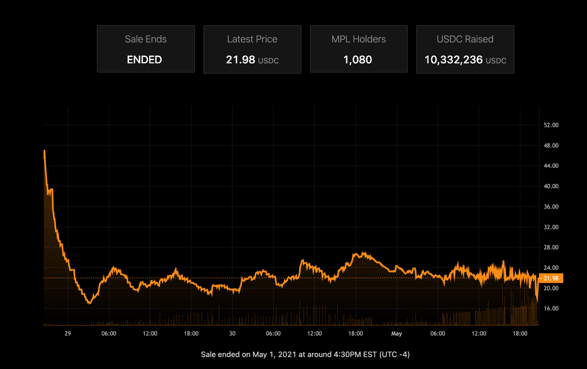

# Liquidity Bootstrapping Curve (LBC)

Strata allows you to bootstrap liquidity by selling tokens with a dynamic price discovery mechanism. This style of sale is done by starting with a high price that lowers over time and
increases with every purchase.

This idea is borrowed from Balancer LBPs on Ethereum. Strata LBC's differ in that there is no initial liquidity needed.

Below is an image of an LBP price vs time:



You can see that the price starts high, and falls until there is demand for the token. From there, it continues to be pulled downward,
but reaches a balance at the fair price where continued demand matches the fall in price.

## Configuration

Strata LBCs require minimal configuration. All you need to specify is

- **baseMint** - What mint would you like to use to collect funds? This is the token users will use to purchase the token you are selling.
- **startPrice** - What price should the mint start at? You should set this to just above the price you expect to sell your NFT. Note that the price can float above this number if there is enough demand.
- **minPrice** - What is the minimum price you would accept? Setting this too high can lead to not selling out. The `startPrice` should not be more than 5x the `minPrice` or the price will drop steeply at the beginning of the mint.
- **interval** - How long should this LBC last for?

Let's create a simple LBC curve to sell `5000` tokens, starting at a price of `5` SOL, with a min price of `1` SOL:

import { CurveConfiguratorFromVariables } from "@site/src/components/CurveConfigurator";

```jsx async
var maxTime = 24 * 60 * 60; // 24 hours
var startSupply = 0;
var endSupply = 5000;
var { curveConfig, reserves, supply } = MarketplaceSdk.lbcCurve({
  interval: maxTime,
  startPrice: 5,
  minPrice: 1,
  targetMintDecimals: 0,
  maxSupply: endSupply,
});
var supplyOffset = supply; // So that ticks format correctly
```

First, let's look at the price descent curve that this generates:

<CurveConfiguratorFromVariables
  priceVsSupply={false}
  priceVsTime
  rateVsTime={false}
/>

You can see that the price drops quickly at first, then more slowly over time. In this case, the first 30 minutes of the launch
will be the most volatile.

In an ideal world, we want to create a balance between the rate the price is falling and the price sensitivity.
If the price sensitivity is roughly equal to the price descent, and we arrive at a fair price, we should see the price hold constant.

Let's look at the price sensitivity. You can increase the seconds since launch or click on the dots in the time plot above to see how the price
sensitivity changes over time. You can also click the dots on this price to see how purchases affect the time decay on the plot above.

<CurveConfiguratorFromVariables
  priceVsSupply
  priceVsTime={false}
  rateVsTime={false}
/>

We can derive a theoretical rate of sale ($R_s$) by looking at the rate of price increase (price per 1 token purchased) vs
the rate of price decrease (price per second)

$$
R_s = P_{inc} / P_{dec}
$$

This is true because

$$
 \frac{price}{sec} / \frac{price}{token} =  \frac{price}{sec} * \frac{token}{price} = \frac{token}{sec}
$$

Plot this:

<CurveConfiguratorFromVariables
  priceVsSupply={false}
  priceVsTime={false}
  rateVsTime={true}
/>
<CurveConfiguratorFromVariables
  priceVsSupply={false}
  priceVsTime={false}
  rateVsTime={false}
  salesVsTime={true}
/>

Notice that the sale rate is very high in the beginning. This is because there will not be a balance of sales to price descent until
a fair price is reached.

## Create an LBC

Let's create an LBP over a 5 minute period that is selling 100 cheap tokens.

```js async name=lbc
var { tokenBonding, targetMint } =
  await marketplaceSdk.createLiquidityBootstrapper({
    baseMint: NATIVE_MINT,
    startPrice: 0.05,
    minPrice: 0.01,
    interval: 5 * 60 * 60,
    maxSupply: 100,
    bondingArgs: {
      targetMintDecimals: 0,
    },
  });
```

```jsx live
function TokenDisplay() {
  const { targetMint } = useVariables(); // Getting token bonding from above code;

  if (tokenBonding) {
    return <Swap id={targetMint} />;
  }

  return <div>Please run the code block above</div>;
}
```

## Withdrawing Funds

The `authority` param (defaulted to the wallet creating the LBC) is allowed to withdraw the bootstrapped liquidity from
the curve. This is done via the `transferReserves` command.

```js async deps=lbc
await tokenBondingSdk.transferReserves({
  tokenBonding,
  amount: 0.001,
  destinationWallet: publicKey,
});
```

You can also close and permanently shutdown the curve via `close`, which can only be done when the reserves are empty. This will
recover the rent fees stored in the curve.

```js
import { getAssociatedAccountBalance } from "@strata-foundation/spl-utils";
```

```js async deps=lbc
var tokenBondingAcct = await tokenBondingSdk.getTokenBonding(tokenBonding);
var transferInstrs = await tokenBondingSdk.transferReservesInstructions({
  amount: (
    await provider.connection.getTokenAccountBalance(
      tokenBondingAcct.baseStorage
    )
  ).value.uiAmount,
  destinationWallet: publicKey,
  tokenBonding,
});
var { instructions, signers } = await tokenBondingSdk.closeInstructions({
  tokenBonding,
});
await tokenBondingSdk.sendInstructions(
  [...transferInstrs.instructions, ...instructions],
  [...transferInstrs.signers, ...signers]
);
```
