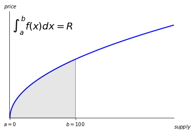

# Advanced Bonding Curves

In our previous examples of bonding curves, we have assumed that no base tokens enter the reserves and no target tokens are burned without taking from the reserves. What if we want to set a relationship between the target supply and reserves that always holds, even in these situations?

This situation is called a Sponsored Burn, which you can read more about [here](https://avsa.medium.com/sponsored-burning-for-tcr-c0ab08eef9d4)

## Invariant Pricing

Let's take an example bonding curve with price, $P$ dictated by:

$$
P = S^{0.5}
$$

We can define $R$, the amount of `Base` tokens stored in the reserves as the area under the curve up to the current supply:

Therefore, taking the indefinite integral, we can say the reserves are

$$
	R = 0.666667 S^{1.5}
$$

Now, what happens when we inject `Base` tokens into the Reserves?

This causes all holders to see an increase in value of the token. Our formula above does not account for this possibility in pricing. So how do we support this model?

Given the `Reserve` function

$$
	R = 0.666667 S^{1.5}
$$

We say that the `Reserve` is always proportional to the `Supply` in a relationship that should never change.

$$
\frac{0.666667 S^{1.5}}{R}
$$

Holding this invariant proportion, if we increase the reserve by some amount $\Delta R$, the increase in supply $\Delta S$ should maintain this formula:

$$
\frac{0.666667 S^{1.5}}{R} = \frac{0.666667 (S + \Delta S)^{1.5}}{R + \Delta R}
$$

:::info Solving Equations
We will not walk through solving the following equations, as we solved them with the aid of computers
:::

Solving for $S$, we can say that given some amount of the base token of the curve $R$, the target tokens we get back should be
$$	
  S = S - (S^{1.5} \frac{(R + \Delta R)}{R})^{0.66666666667}
$$
Likewise, solving for R, we can say our price for some amount of target tokens  S is
$$
  R = \frac{R^{1.5} + R (S + \Delta S)^{1.5}}{S^{1.5}}
$$

Worth noting is that both of these equations fail for R = 0 or S = 0. When this is true, we revert to the base pricing formula of
$$
	R = c 0.666667 S^{1.5}
$$

Where c is a constant that will help set the slope of the initial curve, and thus the initial price.

## Changing Curves

The above math has one interesting property. We can define a curve in terms of a price relation, current `Reserve`, and current `Supply`. This means that, without changing tokens, we can change the shape of our curve. The new invariant will be satisfied for the new curve, and any future purchases or sales will need to follow the new invariant.

## Royalties that go back to Holders

A powerful model that comes from this feature is having a way to reward all token holders. A simple way to see this at work is to put a 5% buy and sell royalty in terms of the `Base` token that goes back into the `Reserve`.

This setup allows holders to improve their position via transaction fees, encouraging circulation of the token.
