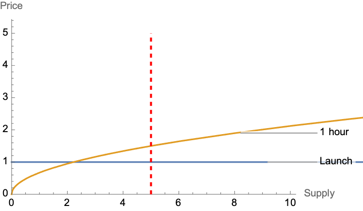
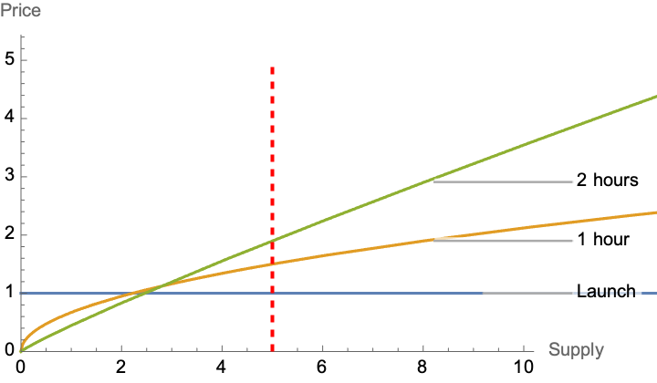

# Fair Launch

Strata has created an innovative way to combat the potentially destructive effects of automated trading bots on a newly launched bonding curve. The goal of Strata Fair Launch is to protect the rewards of being an early adopter. A bonding curve makes it profitable to get in early, particularly one shaped like this:

While this is a desired characteristic of bonding curves, it is also extremely vulnerable to front-running bots. If getting in early means a guarenteed profit, there is a lottery on getting your transaction through first. If there is a lottery on getting your transaction through first, a bot will send 10,000 transactions and clog the network.

So how do we disincentivise bots?

## The Bonding Curve Fair Launch

The goal is to disencentivize bots while still retaining the property that getting into the bonding curve early is ideal. We do this with a gradually steepening bonding curve.

A property of bonding curves is that the area under the price vs supply curve is always equal to the amount of tokens in the reserves. To get a better understanding of how bonding curves work, read [Bonding Curves](./bonding_curves) and [Advanced Bonding Curves](./advanced_bonding_curves)

At launch, the bonding curve looks like this. Let's draw a line to say that there are 5 tokens purchased at launch:

By keeping the price constant for 30 minutes, we can ensure that spamming transactions has no advantage. After this period, we can gradually steepen the curve. This results in upward price pressure, but there is a prisoner's dillemma on when to sell.

Once a second, the curve steepens:

Notice that the area under the curve at 5 tokens is the same. The token just increased in price according to the curve, but there are still the same amount of `Reserve` tokens.

Over time, the curve steepens to its final shape:

## Changing Bonding Curves

The above took advantage of a powerful characteristic of Strata Bonding Curves: they do not determine price only from `Supply`. The current price is a function of both `Supply` and `Reserve`. This means that the underlying shape of the curve can change so long as the area under the new curve matches the area under the old curve. More on this in [Advanced Bonding Curves](./advanced_bonding_curves)
