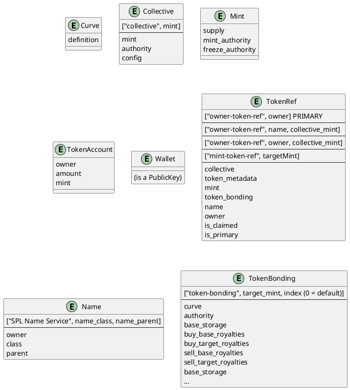

# Fetching Data

In [Social Tokens](./social_tokens), we learned about the on chain structure of Strata:



How do we use this to get and display the data we need? The answer is that we treat it like a giant NoSQL Database

## Solana: A giant Key/Value store

At its core, Solana is just a giant Key/Value store. A public key is the key, and there's some blob of data at that value. Some blobs we make use of are

- Collectives
- Token Ref
- Token Bonding
- Curve
- Token Account
- Token Mint
- Token Metadata

The list goes on. Every one of these has a public key.

Solana has the idea of a Public Key that is deterministically derived from a set of inputs. This is called a Program Derived Address (PDA)

:::note PDA
A [Program Derived Address](https://docs.solana.com/developing/programming-model/calling-between-programs#program-derived-addresses) is an address that can be deterministically derived from a smart contract and a set of inputs. The smart contract "owns" this address, and can sign for operations involving this address.
:::

These deterministically derived addresses give us another tool. Don't have the Public key for a TokenRef on hand? Get it from the wallet of the token holder:

```js async name=owner
// Get the primary social token for your wallet.
var tokenRefKey = (
  await SplTokenCollective.ownerTokenRefKey({
    owner: provider.wallet.publicKey,
    isPrimary: true,
  })
)[0];
```

Now we can fetch that object

```js async deps=owner name=token
var tokenRef = await tokenCollectiveSdk.getTokenRef(tokenRefKey);
```

:::note React
Most of the calls in this guide have React hook equivalents. For example, `useTokenRef`, `useTokenBonding`, `useClaimedTokenRefKey`, etc. Be sure to take a look at the [React Guide](https://docs.strataprotocol.com/react) and [React API](https://docs.strataprotocol.com/api/react/modules#functions)
:::

## The Star Schema: TokenRefs

The Token Ref is at the heart of Strata. Given a token ref, you can fetch any information you need about a social token:

```js
import { getMintInfo, getTokenAccount } from "@strata-foundation/spl-utils";
```

```js async deps=token
var metadata = await tokenMetadataSdk.getMetadata(tokenRef.tokenMetadata);
var tokenBonding = await tokenBondingSdk.getTokenBonding(tokenRef.tokenBonding);
var collective = await tokenCollectiveSdk.getCollective(tokenRef.collective);
var mint = await getMintInfo(provider, tokenRef.mint);
var collectiveMint = await getMintInfo(provider, collective.mint);
var buyBaseRoyalties = await getTokenAccount(
  provider,
  tokenBonding.buyBaseRoyalties
);
```

### Getting to the Token Ref

You can get to a token ref if you know any of the following sets of information:

- **owner** - The wallet of the individual, where you want to access their primary social token
- **owner, collective** - The social token of a wallet within a particular collective
- **name, collective** - An unclaimed social token registered to a name service name within a collective
- **mint** - The Mint of the social token

All of these can be accessed from `SplTokenCollective.ownerTokenRefKey` and `SplTokenCollective.mintTokenRefKey`:

```js
import { getNameAccountKey, getHashedName } from "@solana/spl-name-service";
```

```js async deps=token
var primaryTokenRef = (
  await SplTokenCollective.ownerTokenRefKey({
    owner: provider.wallet.publicKey,
    isPrimary: true,
  })
)[0];
var collectiveTokenRef = (
  await SplTokenCollective.ownerTokenRefKey({
    owner: provider.wallet.publicKey,
    mint: collective.mint,
  })
)[0];
var unclaimedCollectiveTokenRef = (
  await SplTokenCollective.ownerTokenRefKey({
    name: await getNameAccountKey(await getHashedName("some-name")),
    mint: collective.mint,
  })
)[0];
var mintTokenRef = (await SplTokenCollective.mintTokenRefKey(tokenRef.mint))[0];
```

## Token Bonding

Token bonding instances are also indexed by mint. You can get a token bonding from a mint using `SplTokenBonding.tokenBondingKey(mint)`

```js async
var tokenBondingKey = (
  await SplTokenBonding.tokenBondingKey(
    SplTokenCollective.OPEN_COLLECTIVE_MINT_ID
  )
)[0];
var openCollectiveBonding = await tokenBondingSdk.getTokenBonding(
  tokenBondingKey
);
var isTheRightCurve =
  SplTokenCollective.OPEN_COLLECTIVE_BONDING_ID.equals(tokenBondingKey);
```

## Solana as a Graph

Using PDAs and Public Keys, Solana begins to act like a graph that we can traverse. Use a public key to access a blob of data that gives you another public key. This is an edge to another node in the Solana graph. An edge is either explicit, as `tokenRef.mint`, or via a PDA

Want to go from a mint to the wallet of the user this social token represents? Go from mint --> token ref --> owner:

```js
var mint = new PublicKey("....");
var mintTokenRefKey = (await SplTokenCollective.mintTokenRefKey(mint))[0];
var tokenRef = await tokenCollectiveSdk.getTokenRef(tokenRef.mint);
var wallet = tokenRef.owner;
```
