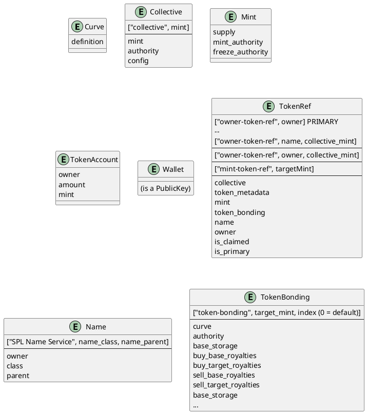
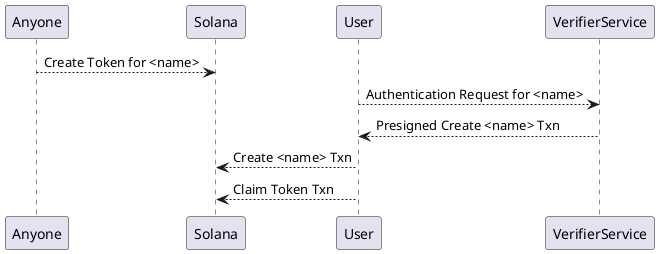

# Social Tokens

A social token is actually like one large join-table. It is the intersection of

  * A collective
  * An owner's wallet
  * A token mint
  * Token metadata (name, symbol, etc)
  * A bonding curve for that token


## State

Strata has no SocialToken struct; as the token itself is the Social Token. Instead, strata has a `TokenRef`. The following [Entity Relationship Diagram (ERD)](https://plantuml.com/ie-diagram) shows the state structures on chain 



# Creation

Let's create a Social Token as part of a new collective.

First, create a collective:

```js async name=collective
// Create a simple exponential curve 0.001 sqrt(S)
var curve = await tokenBondingSdk.initializeCurve({
    config: new ExponentialCurveConfig({
    c: 0.001,
    b: 0,
    pow: 1,
    frac: 2
  })
});

// Create a collective around the Target of the above token bonding
var { collective, tokenBonding } = await tokenCollectiveSdk.createCollective({
  metadata: {
    name: "My Collective",
    symbol: "tCOLL",
    uri: "https://strataprotocol.com/tCOLL.json",
  },
  bonding: {
    curve,
    baseMint: new PublicKey("So11111111111111111111111111111111111111112"),
    targetMintDecimals: 2,
    buyBaseRoyaltyPercentage: 5,
    buyTargetRoyaltyPercentage: 5,
    sellBaseRoyaltyPercentage: 0,
    sellTargetRoyaltyPercentage: 0
  },
  authority: publicKey,
  config: {
    isOpen: true,
    unclaimedTokenBondingSettings: {
      buyTargetRoyalties: {
        // This account is owned by the name service name, and will be transferred to the person who claims this token
        ownedByName: true
      }
    }
  }
});
var collectiveTokenBonding = tokenBonding;
```

We can fetch that data:

```js async deps=collective
var collectiveAcct = await tokenCollectiveSdk.getCollective(collective);
var collectiveBondingAcct = await tokenBondingSdk.getTokenBonding(tokenBonding);
```

Now, create a social token within the collective:

```js async name=token deps=collective
var { ownerTokenRef, tokenBonding } = await tokenCollectiveSdk.createSocialToken({
  isPrimary: false, // Creates a social token explicitly associated with the collective by pda, instead of the wallet alone.
  collective,
  metadata: {
    name: "Learning Strata Token",
    symbol: "luvSTRAT",
    uri: "https://strataprotocol.com/luvSTRAT.json",
  },
  ignoreIfExists: true, // If a Social Token already exists for this wallet, ignore.
  tokenBondingParams: {
    curve,
    buyBaseRoyaltyPercentage: 0,
    buyTargetRoyaltyPercentage: 5,
    sellBaseRoyaltyPercentage: 0,
    sellTargetRoyaltyPercentage: 0
  }
});
```

Fetch the created token:

```js async name=fetch_token deps=token
var tokenBondingAcct = await tokenBondingSdk.getTokenBonding(tokenBonding);
var ownerTokenRefAcct = await tokenCollectiveSdk.getTokenRef(ownerTokenRef);
```

Notice that we created a non-primary social token here. Most wallets will have one social token. For ease of lookup, social tokens refs are a PDA of the owner alone. In the case where one wallet belongs to several collectives, they should choose one `isPrimary` token that is used for lookups on storefronts. 

## Unclaimed Creation

Now, let's add an unclaimed token to the collective. You can read more about unclaimed tokens in [collectives](./collectives)

Unclaimed tokens make use of the [spl-name-service](https://spl.solana.com/name-service).

The name service allows you to create unique strings on chain owned by a particular wallet. A name consists of

  * **Class** - The name class must sign the issuance of a name.  
  * **Owner** - The owner of this name
  * **Parent** - The parent name of this name. In practice, this can be used like a class hierarchy.
  * **Parent Owner** - The parent name has an owner. If a name has a parent, the parent's owner must also sign the issuance of this name.

This might seem a little abstract, so let's go with an example. Let's say we want to associate unclaimed tokens with twitter users. When a twitter user verifies they own their handle, we let them claim the token.
We want to gate who can claim ownership of a twitter handle, so we will assign a verifier keypair as the name class that must approve issuance.

While this example is focused on twitter, this could just as easily work for usernames on your own website. This is a generic framework for onboarding social tokens that users can later claim using their wallet.

This is what we will build:





First, we create a name parent that is our twitter tld

:::note TLD
We often refer to a name parent as the Top Level Domain (TLD). In the case of twitter, we have a twitter top level domain that all twitter handles are under.
:::

```js
import { Numberu32, Numberu64, NAME_PROGRAM_ID, createInstruction, createNameRegistry, getNameAccountKey, getHashedName, 
NameRegistryState } from "@solana/spl-name-service";
import { Keypair, SystemProgram, sendAndConfirmRawTransaction } from "@solana/web3.js";
```
```jsx async name=tld
 // Make this name unique to verifier so others can run this tutorial
var verifier = Keypair.generate();
var name = "twitter-" + verifier.publicKey.toBase58();
var twitterTld = await getNameAccountKey(await getHashedName(name));

if (!(await provider.connection.getAccountInfo(twitterTld))) {
  const nameTx = new Transaction({
    recentBlockhash: (await connection.getRecentBlockhash()).blockhash
  })
  nameTx.instructions.push(
    await createNameRegistry(
      connection,
      name,
      NameRegistryState.HEADER_LEN,
      provider.wallet.publicKey, // Payer
      verifier.publicKey // Owner
    )
  )
  await provider.send(nameTx)
}
```

Now we have a top level domain. Every twitter handle must be verified by us, and exist under this top level domain:

```jsx async name=name deps=tld
var nameOwner = Keypair.generate(); // This wallet will eventually own this twitter handle
var twitterHandle = "test-" + nameOwner.publicKey.toBase58();
var hashedTwitterHandle = await getHashedName(twitterHandle);
var twitterName = await getNameAccountKey(
  hashedTwitterHandle,
  undefined, // No class
  twitterTld // Every twitter handle is under our tld
)
```

Anyone can try to create this name, but without the verifier, the transaction will fail:

```jsx async name=fail deps=name
var nameTx = new Transaction()
nameTx.instructions.push(
  await createNameRegistry(
    connection,
    twitterHandle,
    NameRegistryState.HEADER_LEN,
    publicKey, // payer
    nameOwner.publicKey, // owner
    await connection.getMinimumBalanceForRentExemption(NameRegistryState.HEADER_LEN), // lamports
    undefined, // no class
    twitterTld // parent
  )
)
// Explicitly don't have the verifier sign this, it should fail
var txid = await provider.send(nameTx);
```

Let's create an unclaimed token for the twitter handle  `"test-..."`:

:::note Uncreated Name
The name service name for the user does not have to exist for us to create a token for them. We can lazily create the name when the user wants to claim their token. This also allows us to pass the fees for the name creation on to the user.
:::

```js async name=unclaimed deps=collective,name
var { ownerTokenRef, tokenBonding } = await tokenCollectiveSdk.createSocialToken({
  collective,
  name: twitterName, // Associate the social token with the created name
  metadata: {
    name: "Learning Strata Token",
    symbol: "luvSTRAT",
    uri: "https://strataprotocol.com/luvSTRAT.json",
  },
  ignoreIfExists: true, // If a Social Token already exists for this name, ignore.
  tokenBondingParams: {
    curve,
    buyBaseRoyaltyPercentage: 0,
    buyTargetRoyaltyPercentage: 5,
    sellBaseRoyaltyPercentage: 0,
    sellTargetRoyaltyPercentage: 0
  }
});
var tokenBondingAcct = await tokenBondingSdk.getTokenBonding(tokenBonding);
```

Now, we create a service that is able to verify the user owns the twitter handle. When the service verifies this twitter handle, it returns a presigned transaction:

:::note Verifier Key
You should keep your verifier key secret, but it will need to be passed in to your server that gate keeps twitter handle creation
:::

```jsx async name=presign deps=name
var space = 1000; // Extra space to store things on the name
var instructions = [createInstruction(
  NAME_PROGRAM_ID, // name program id
  SystemProgram.programId, // system program id
  twitterName, // name to create
  nameOwner.publicKey, // name owner
  provider.wallet.publicKey, // Fee payer, normally we'd make the person claiming the handle pay
  hashedTwitterHandle,
  new Numberu64(await connection.getMinimumBalanceForRentExemption(space)), // lamports
  new Numberu32(space), // Space for extra data on the name service name
  undefined, // Name class, there is none here
  twitterTld, // Name parent.
  verifier.publicKey // Name owner. Twitter verifier acts as owner of the parent
)];
var transaction = new Transaction({ 
  recentBlockhash: (await provider.connection.getRecentBlockhash()).blockhash,
  feePayer: provider.wallet.publicKey 
});
transaction.add(...instructions);
transaction.partialSign(verifier);

var presignedTransaction = transaction.serialize({ requireAllSignatures: false, verifySignatures: false }).toJSON()
```

:::note Reverse Twitter
The above lets us go from a twitter handle to a wallet. What if we'd like to go from a wallet to a twitter handle? You should look at appending an instruction similar to the [reverse-twitter-registry](https://github.com/solana-labs/solana-program-library/blob/f83240a8684bc20cbf9c592fa2453c7a2103076b/name-service/js/src/twitter.ts#L401)
:::

Now, let's create the name using the presigned transaction
```js async name=create_name deps=presign
if (!(await connection.getAccountInfo(twitterName))) {
  const tx = Transaction.from(presignedTransaction.data);
  const signed = await provider.wallet.signTransaction(tx);
  await sendAndConfirmRawTransaction(connection, signed.serialize());
}
```

Buy some of the unclaimed coin. This should result in 5% royalties accumulated into a temporary account. Here we can use the Instructions modifier to group these buy calls together:

```js async name=buy deps=unclaimed
var { instructions, signers } = await tokenBondingSdk.buyInstructions({
  tokenBonding: collectiveTokenBonding,
  desiredTargetAmount: 10,
  slippage: 0.05
});
var { instructions: sellInstructions, signers: sellSigners } = await tokenBondingSdk.buyInstructions({
  tokenBonding: tokenBonding,
  baseAmount: 10,
  slippage: 0.05
});
var tx = new Transaction();
tx.add(...instructions, ...sellInstructions);
await provider.send(tx, [...signers, ...sellSigners]);
var royaltiesBalance = (await connection.getTokenAccountBalance(tokenBondingAcct.buyTargetRoyalties)).value;
```

Now, let's have the user claim the social token. We should see the funds move to their Associated Token Account:

:::info Owned By Name
When creating a collective that allows unclaimed tokens, be sure to include the `ownedByName` field in the royalties configuration for every account you want to transfer to the name owner.
:::

```js async name=claim deps=buy,create_name
var { instructions, signers } = await tokenCollectiveSdk.claimSocialTokenInstructions({
  tokenRef: ownerTokenRef,
  owner: nameOwner.publicKey,
  symbol: "CLM",
});
var tx = new Transaction();
tx.add(...instructions);
await provider.send(tx, [nameOwner]);

var balance = await getAssociatedAccountBalance(connection, nameOwner.publicKey, tokenBondingAcct.targetMint);
```
